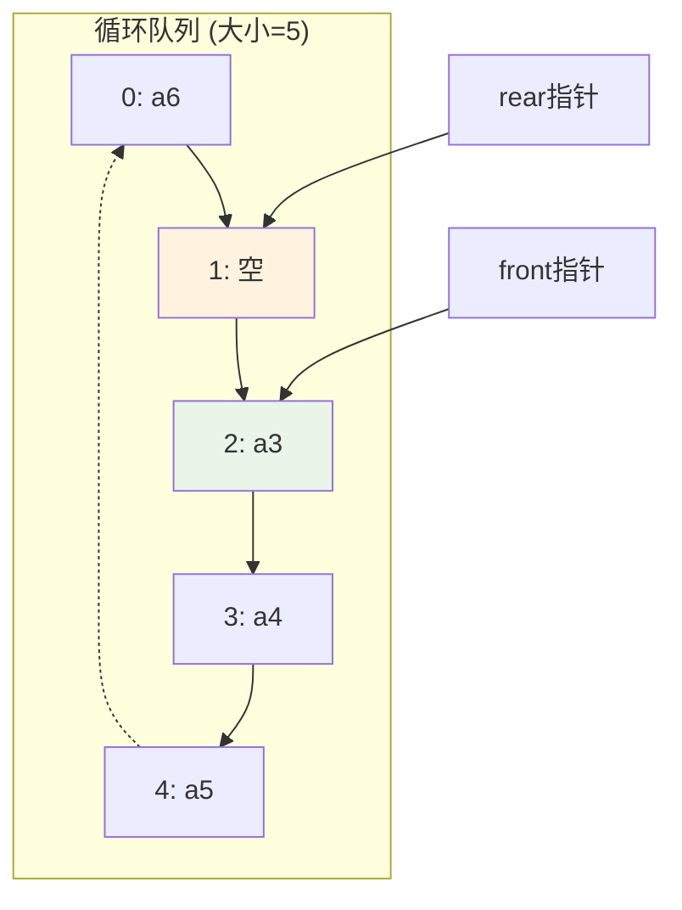

队列（queue）是只允许在一端进行插入操作，在另一端进行删除操作的线性表

这个的特点是**先进先出（First In First Out）**
然后是允许插入的一端称为队尾（rear），允许删除的一端称为队头(front)。  
向队列中插入新的数据元素称为入队。  
从队列中删除队头元素称为出队。

```less
队列示意图（先进先出 FIFO）：

    ┌─────┬─────┬─────┬─────┬─────┐
    │  A  │  B  │  C  │  D  │     │
    └─────┴─────┴─────┴─────┴─────┘
       ↑                       ↑
    队头(front)             队尾(rear)

元素入队过程：
1. 空队列：    [     ][     ][     ][     ]
                  ↑
            front/rear

2. A入队：    [  A  ][     ][     ][     ]
                 ↑     ↑
               front  rear

3. B入队：    [  A  ][  B  ][     ][     ]
                 ↑      ↑
               front   rear

4. C入队：    [  A  ][  B  ][  C  ][     ]
                 ↑             ↑
               front          rear

元素出队过程：
1. A出队：    [     ][  B  ][  C  ][     ]
                        ↑      ↑
                      front   rear

2. B出队：    [     ][     ][  C  ][     ]
                        ↑      ↑
                      front   rear

```

### 队列的顺序存储结构

### 顺序队列

用一组地址连续的存储单元，依次存放从队头到队尾的数据元素，称为顺序队列。实现顺序队列需要设两个指针：队头指针（front）和队尾指针（rear），分别指向队头元素和队尾元素。

```less
顺序队列结构示意图：

数组索引:  [0]  [1]  [2]  [3]  [4]  [5]  [6]  [7]
存储内容:  [A]  [B]  [C]  [D]  [  ] [  ] [  ] [  ]
            ↑              ↑
          front          rear

队列状态：
- 队头元素：A（位于索引0）
- 队尾元素：D（位于索引3）
- 下一个插入位置：索引4
- 队列长度：4个元素

插入操作：
- 新元素将插入到 rear 指针位置
- 插入后 rear 指针向后移动一位

删除操作：
- 从 front 指针位置删除元素
- 删除后 front 指针向后移动一位
```

**如果在插入 E 的基础上再插入元素 F，将会插入失败。因为 rear == MAXSIZE，尾指针已经达到队列的最大长度。但实际上队列存储空间并未全部被占满，这种现象叫做假溢出**

```less
假溢出问题：

数组索引:  [0]  [1]  [2]  [3]  [4]  [5]
存储内容:  [  ] [  ] [  ] [C]  [D]  [E]
                           ↑         ↑
                          front    rear

问题分析：
- 实际可用空间：索引0、1、2（3个位置）
- rear指针已到达数组末尾（索引5）
- 即使前面有空闲空间，也无法继续插入新元素
- 这种现象称为"假溢出"

```

通过上图可以发现队头出队、对尾入队造成了数组前面的空间未被利用而出现假溢出。

为了解决“假溢出”现象，使得队列的存储空间得到充分利用，一个非常巧妙的方法就是将顺序队列的数组看成一个头尾相接的循环结构。

### 循环队列



**现在队满了，但是队头指针和队尾指针相等（队空的时候也是这样）。**  
那么该怎么判断队空还是队满？

> 两种解决方案

1. 设置一个计数器，开始的时候为 0，当有元素入队时+1，有元素出队时-1，值为 MAXSIZE 时队满
2. 保留一个元素空间，当队尾指针指的空单元的下一个单元是队头指针所指单元是为对满

**队满的条件（Queue.rear+1）%MAXSIZE == Queue.front**  
**队空的条件 Queue.rear=Queue.front**

循环队列结构

```c
#define MAXSIZE 20
/*循环队列的存储结构*/
typedef structQueue
{
    int data[MAXSIZE];
    int front;    //头指针
    int rear;    //尾指针
}Queue;
```

操作

```c
/*初始化空队列*/
int InitSeQueue(Queue* queue);
/*获得队列长度*/
int GetLength(Queue* queue);
/*判空*/
bool isEmpty(Queue* queue);
/*判满*/
bool isFull(Queue* queue);
/*入队操作*/
int EnterQueue(Queue* queue, int e);
/*出队操作*/
int ExitQueue(Queue* queue, int e);
```

### 初始化空队列

```c
void InitSeQueue(Queue* queue)
{
    queue->front = 0;
    queue->rear = 0;
    return 0;
}
```

### 获得队列长度

```c
int GetLength(Queue* queue)
{
    return (queue->rear-queue->front+MAXSIZE)%MAXSIZE;
}
```

### 判空

```c
bool isEmpty(Queue* queue)
{
    return queue->front==queue->rear;
}
```

### 判满

```c
bool isFull(Queue* queue)
{
    return (queue->rear+1)%MAXSIZE==queue->front;
}
```

### 入队

```c
void EnterQueue(Queue* queue, int e)
{
    if (isFull(queue))
    {
        printf("队列满了\n");
        return;
    }
    else
    {
        queue->data[queue->rear] = e;
        queue->rear = (queue->rear + 1) % MAXSIZE;//求模，rear的值就在[0,MAXSIZE-1]循环
    }
}
```

`queue->data[queue->rear] = e;`
将要入队的元素 e 存储到队尾指针 rear 所指向的位置，这是实际的数据插入操作

`queue->rear = (queue->rear + 1) % MAXSIZE;`
将队尾指针 rear 向后移动一位
使用模运算(queue->rear + 1) % MAXSIZE 实现循环效果
当 rear 到达数组末尾时，会自动回到数组开头（索引 0）,利用了数组的存储空间，避免了顺序队列的"假溢出"问题

### 出队

```c
void ExitQueue(Queue* queue, int*e)
{
     if (isEmpty(queue))
    {
        printf("已经是空队列了\n");
        return;
    }
    else
    {
        *e = queue->data[queue->front];
        queue->front = (queue->front + 1) % MAXSIZE;//注意不要写成(queue->front - 1)
    }
}
```

其中 `*e = queue->data[queue->front];`

`queue->front`是队头指针，指向队列的第一个有效元素位置
`queue->data[queue->front]`表示获取队头位置存储的数据元素
`e`是一个指向整型变量的指针
`*e`表示对这个指针进行解引用，访问指针指向的内存位置

**整体操作**： - 将队头元素的值赋给调用者传入的变量地址 - 这样调用函数就能获取到出队的元素值

### 队列的链式存储结构

链队列由单链表组成，队头指针指向链表的头结点，队尾指针指向尾节点。空队列时队头指针和队尾指针都指向头节点。

```less
链队列结构示意图：

空队列状态：
    front → [头节点] ← rear
              ↓
             NULL

入队元素A后：
    front → [头节点] → [A] ← rear
             ↓          ↓
            [A]       NULL

入队元素B后：
    front → [头节点] → [A] → [B] ← rear
               ↓        ↓     ↓
              [A]      [B]   NULL

入队元素C后：
    front → [头节点] → [A] → [B] → [C] ← rear
              ↓         ↓     ↓     ↓
             [A]       [B]   [C]   NULL

出队元素A后：
    front → [头节点] → [B] → [C] ← rear
             ↓         ↓      ↓
            [B]       [C]    NULL


使用单链表实现，front 指针指向头节点
rear 指针指向队尾节点
头节点不存储数据，仅作为队列的起始标记
入队操作在队尾进行，出队操作在队头进行
不存在假溢出问题，可根据需要动态分配内存空间
```

链队列结构

```c
/*结点结构*/
typedef struct Node
{
    int data;
    struct Node *next;
}Node;

/*链队列结构*/
typedef struct LinkQueue
{
    Node* front,rear;//队头、队尾指针
}LinkQueue;
```

### 初始化链队列

```c
void InitLinkQueue(LinkQueue* LinkQ)
{
    Node* head = malloc(sizeof(Node));
    if (LinkQ != NULL && head != NULL)
    {
        LinkQ->front = LinkQ->rear = head;
        head->next = NULL;
    }
}
```

### 判空

```c
bool isEmpty(LinkQueue* LinkQ)
{

    return LinkQ->front == LinkQ->rear;
}
```

### 入队

```c
void EnterLinkQueue(LinkQueue* LinkQ, int x)
{
    /* 创建新节点并分配内存空间 */
    Node* node = malloc(sizeof(Node));
    /* 将待插入数据存入新节点 */
    node->data = x;
    /* 设置新节点的后继指针为空 */
    node->next = NULL;
    /* 将新节点连接到当前队尾节点之后 */
    LinkQ->rear->next = node;
    /* 更新队尾指针，指向新插入的节点 */
    LinkQ->rear = node;
}
```

链队列的入队操作：

创建新节点：动态分配内存创建新节点
设置节点数据：将入队元素 x 存入新节点
连接节点：将新节点链接到当前队尾节点之后
更新队尾指针：将队尾指针指向新加入的节点

### 出队

```c
void ExitLinkQueue(LinkQueue* LinkQ, int* x)
{
    if (isEmpty(LinkQ)) //首先判断队列是否为空，如果为空则直接返回
        return;
    Node* node = malloc(sizeof(Node));
    //保留删除结点的信息
    node = LinkQ->front->next;
    *x = LinkQ->front->data; //将队头节点的数据赋值给输出参数x
    //建立新联系
    LinkQ->front->next = node->next; // 跳过被删除节点，将队头直接连接到下一个节点
    //如果队尾出队了，那么就是空队
    if (LinkQ->rear == node)
        LinkQ->front = LinkQ->rear;
    free(node);
}
```
