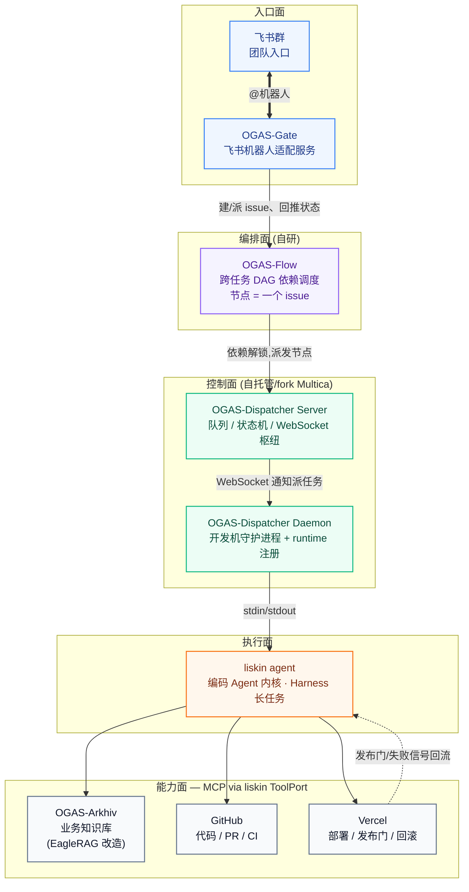
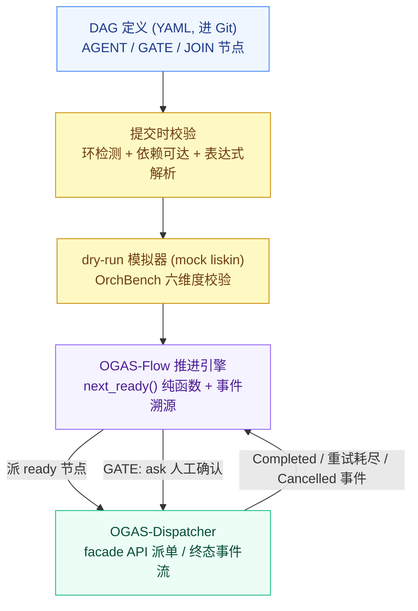
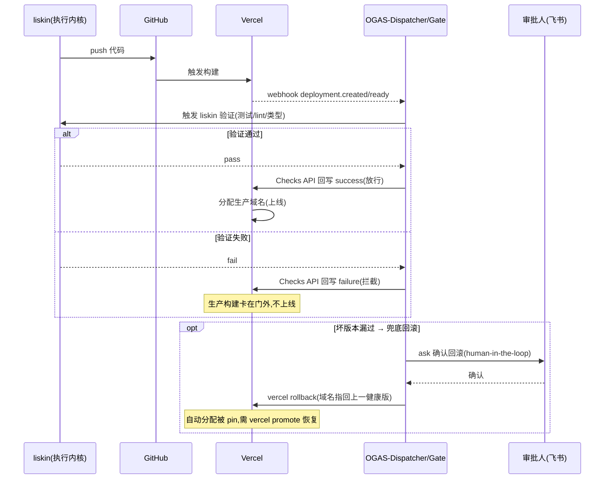
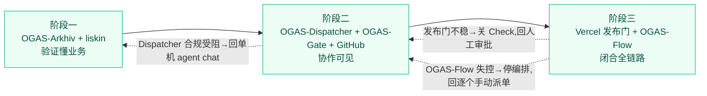

## 概述

# Agent 驱动的研发全链路协作平台

# RFC-0802: Glushkov-OGAS(Operational Generate Agent System)

> 项目 Glushkov ── OGAS,Operational Generate Agent System
> 状态 Draft
> 关联材料 项目 specs(monorepo/spec 规范)、ADR-0001~0004

Glushkov-OGAS(Operational Generate Agent System,之后简称 OGAS)是一个自托管的 Agent 研发生命周期协作平台,让整个团队能以受控、可编排、可回滚的方式驱动 Agent,把一个需求从知识检索一路自动跑到代码交付和线上部署。

OGAS 把团队开发机上的编码 Agent 作为服务统一暴露出去,让成员在飞书等 im 中能发起任务(OGAS-Gate),背后由控制平面(OGAS-Dispatcher)负责调度、队列和权限,由编排层(OGAS-Flow)把多个任务按依赖关系串成 DAG 执行,由知识库(OGAS-Arkhiv)提供业务知识检索,最终打通 GitHub 与 Vercel 部署环节,打通上线和发布。

**OGAS(Operational Generate Agent System) 组件**

| OGAS 组件           | 角色                                                    | 底层/来源         |
| ------------------- | ------------------------------------------------------- | ----------------- |
| **OGAS-Dispatcher** | 控制面:任务队列、状态机、WebSocket 枢纽、开发机守护进程 | 上游 Multica      |
| **OGAS-Arkhiv**     | 知识面:业务知识库 MCP Server                            | 上游 EagleRAG     |
| **OGAS-Flow**       | 编排面:跨任务 DAG 依赖调度                              | 自研              |
| **OGAS-Gate**       | 入口面:飞书机器人适配服务                               | 自研              |
| **Liskin_Agent**    | 执行面:编码 Agent 内核                                  | 上游 Liskin_Agent |

---

## 一、背景与问题

在研发链路中,痛点集中在三处,分"Agent 能力边界""团队协作""链路打通"三层:

- **第一,通用编码 Agent 往往在大型代码库里暴露相似的问题**:

    **「看不懂代码库、缺乏全局认知、回答跑偏」** 模型足够聪明,但它拿不到正确的上下文,Agent 在实际开发中容易发生上下文过载(一次读入太多文件反而判断分散)、上下文不足(模块边界和领域术语只能靠猜测推进)、以及搜索噪音[[1]](https://zhuanlan.zhihu.com/p/2043016346271839700)等等问题。关于 Coding Agent 大多数演示是从零搭一个简单的 Todo 类应用,而真实代码库是"有十五年历史、充满未文档化的隐性契约、蔓延到四十个文件的服务层"[[2]](https://tianpan.co/zh/blog/2026-04-19-ai-coding-agents-brownfield-legacy-code)。Anthropic 提出的解决方案是让"代码库需要适配 AI",而不是只靠模型[[3]](https://developer.aliyun.com/article/1737453)。但是在长期迭代历史悠久的大型代码仓库中,我们需要一种 AI Agent 适应代码的方案(关于 AI 友好架构这一点也有过论述,见作者博客 https://zhongye1.github.io/p/f77cee45/ )。

    **「生成代码不合规范、偏离业务逻辑、有幻觉」** AI 可能会生成"引用不存在的函数、使用想象出来的 API、语法正确但逻辑错误"的代码[[4]](https://arxiv.org/html/2404.00971v3)。业界普遍的应对叫法是"给 AI 制定 coding guidelines / 强制代码标准",把团队规范做成 spec 喂给 Agent[[5]](https://blog.jetbrains.com/idea/2025/05/coding-guidelines-for-your-ai-agents/),而我们要将这套方法论内化到 Agent Core 中。

    **「复杂任务接不住、跨模块多步骤难完成」** Agent 容易出现上下文腐烂(context rot)和跑偏(drift):比如前 20 个回合正常,到第 40 个回合 Agent 开始改不该改的文件、重复调用失败的工具、甚至忘了最初要解决的问题[[6]](https://www.tinyash.com/blog/mindlas-ai-agent-drift-problem/)。有时也有长上下文压缩导致任务链断裂的问题[[7]](https://www.80aj.com/2026/07/23/ai-agent-context-compression/)。于是我们要给长任务 Agent 设计有效的 harness[[8]](https://www.anthropic.com/engineering/effective-harnesses-for-long-running-agents)。

    **「质量缺乏反馈、开发者对产出没把握」** 在当前阶段,仍存在"AI 信任鸿沟(AI trust gap)",而开发者往往期望在最少人工审查下把 AI 生成代码部署到生产[[9]](https://stackoverflow.blog/2026/02/18/closing-the-developer-ai-trust-gap/)。Agent 的运行过程与最终结果缺乏科学和客观的质量评估。

- **第二,Agent 的高自主性与不透明推理对传统可观测性方法构成了显著的挑战**[[10]](https://arxiv.org/html/2411.03455v3)。即便单个 Agent 好用,它也只是"某个人在自己机器上跑的一个 loop":任务不透明,团队其他人无法 review Agent 的执行链路。业界仍缺一个正式的过程模型来定义 Agent 之间及其与人类监督者如何贯穿整个研发生命周期协作[[11]](https://arxiv.org/pdf/2510.23664)。

- **第三,从"需求"到"上线"这条链路仍需要打通**——Agent 擅长写代码,却只覆盖生命周期的一段,现有 SE Agent 大多是各自解决孤立子问题的"专才",缺一个把整条链路贯通的统一体[[12]](https://www.cs.purdue.edu/homes/lintan/publications/USEagent-icse26.pdf)。而恰恰是评审、CI、部署这些后期阶段,因其产出可通过可执行反馈客观评估,才是 Agent 最能落地的地方,工业界的普遍做法是把 Agent 动作限制在可验证、有边界的空间里[[13]](https://arxiv.org/html/2605.15245);但今天这些环节的衔接仍靠人肉,没有一个把 issue、代码、部署串成闭环的编排机制,而这层工作流管理本身就是公认的开放难题[[14]](https://www.arxiv.org/pdf/2510.02557)。

## 二、设计目标

OGAS 目前期望就这一套架构达成共识:

**执行层**用 liskin_code_Agent 作为内核,通过它的 `ToolPort` 注入 OGAS-Arkhiv(业务知识)、GitHub(代码与 CI)、Vercel(部署)三类 MCP 能力;

**控制层**用 OGAS-Dispatcher 管理任务派给对应机器上的对应 Agent、具体到 Agent 的执行和状态;

**入口层**用 OGAS-Gate 把任务的创建、指派、状态回流搬进团队 im 群聊(如飞书);

**编排层**用自研的 OGAS-Flow 支持多个任务按依赖前后串联执行,且编排层本身保持确定性、不介入 Agent 内部推理。

## 三、现状

目前OGAS工程体系中，负责执行的Agent内核是liskin：https://github.com/Zhongye1/liskin_code_agent

liskin 的架构已经为"被外部调度"做好了准备。它的 Kernel 与 Client 是解耦的,对外通过 `agent exec` 提供 headless 的无头执行模式,内部走 InProcessKernelClient,天然适合被守护进程以 stdin/stdout 的方式驱动。

liskin 自带 Harness 长任务框架,任务状态落在 `.liskin/harness/` 里,节点可中断、可恢复、可审计,这正好是我们做"任务级容错"想要的底座。其 Sandbox 用路径白名单加命令黑名单再叠加 auto/ask/deny 三档确认,给了我们在自动化链路里插入人工卡点的抓手。

liskin 的 MCP client 支持目前处于 Phase-1 进行中,对 GitHub/Vercel 的集成也标注为在建。这两块能力明确会做完,其完整形态对齐 pi agent 的能力边界——也就是说,MCP 接入、GitHub/Vercel 的原生集成不是要不要有的问题,而是时间问题,终态可以参考 pi agent 已经跑通的形态来预期。我们的排期假设是在阶段二、阶段三可以放心地把这些能力算进 liskin 的既定路线,而不必自己造完整实现,只需在集成落地前用最小 shim 过渡。

EagleRAG 已经是一个成熟的 MCP Server,提供 streamable HTTP 的 `/mcp` 端点和 stdio 两种接入方式,核心工具覆盖 ingest/query/retrieve,并用 plugin_namespace 到 Milvus 的映射做多租户隔离。在当前的体系中,将它改造成 OGAS-Arkhiv,主要是围绕权限和命名空间做团队化封装,底层检索能力可以直接复用。

Multica 是一个开源的 Go 平台,其形态可以作为我们想要的控制平面参考。它的 Server 负责协调、workspace/issue/队列/权限管理和 WebSocket hub,明确不做模型推理也不做 Agent 执行;它的 Daemon 装在开发机上,扫描本地的 AI CLI、注册 runtime、在隔离工作区里调用工具并返回结果;Runtime 是 daemon 与某个 AI 工具的配对,目前只支持本地,云端在等候名单上。任务通过 WebSocket 下发,状态机是 Queued→Dispatched→Running→Completed/Failed/Cancelled,带 dispatch 五分钟、running 两个半小时的超时和可重试的失败处理,而且它原生就支持 pi runtime。唯一缺的,是跨任务的 DAG 编排——这恰好是我们要自建的那一层。它以 Docker Compose、二进制或 K8s 自托管。

Vercel 这边,构建与发布是解耦的。它的 Deployment Checks 能以阻塞式检查的形式,在生产构建完成、域名分配之前把版本卡住,检查可以通过 GitHub Actions 或 Checks API 的 webhook(deployment.created/ready/succeeded/error)来驱动。它的 Instant Rollback(`vercel rollback [id|url]`)把域名指回上一个部署,不需要重新构建;但有个坑要注意,回滚之后自动分配会被关掉(版本被 pin 住),得用 `vercel promote` 才能恢复。目前的设计中,检查到底阻塞还是不阻塞,以及超时后放行还是拦截,都由开发者按项目自行配置。

关于编排层怎么工程化实现,近期的学术与工业工作给出了相当一致的方向:Agint 把软件工程任务先编译成图再执行,主张即便 AI 步骤不确定、图的执行也要保持确定,并用 SHIM 节点做"含 AI 组件却仍确定性推进"的混合执行[[15]](https://www.arxiv.org/pdf/2511.19635);而微软 Conductor 更直接地论证了"结构已知的工作流不该让 LLM 动态路由",而应把编排做成声明式、确定性、消耗零 token 的一层,并把执行、上下文流转、人工监督显式拆开[[16]](https://opensource.microsoft.com/blog/2026/05/14/conductor-deterministic-orchestration-for-multi-agent-ai-workflows/);OrchBench 则给出了"把编排计划从执行中剥离、用确定性模拟单独评估"的方法,沿结构、覆盖、缺失子任务、依赖正确性、冗余、并行合理性六个维度检验 DAG[[17]](https://arxiv.org/html/2607.25656v1);而崩溃恢复这一层,durable execution 的成熟做法是用事件历史确定性重放来替代手搓状态机[[18]](https://temporal.io/blog/temporal-replaces-state-machines-for-distributed-applications)。这些结论共同支撑了下文 OGAS-Flow 的设计取向。

## 四、设计方案

本 RFC 里目前不锁定具体的接口签名、数据表结构、prompt 内容,那些属于后续设计文档;

整体思路是控制面与执行面彻底分离,再在两端分别接上入口和编排,形成四层各司其职的结构。下图是 OGAS 的整体架构与数据流向,供评审对照:

**执行面以 liskin 为内核。** liskin 的关键价值在于它内核与外壳解耦,`LLMPort`/`ToolPort`/`StorePort` 三个端口让内核只跟抽象契约打交道,换模型、换工具来源、换存储都不动内核[[19]](https://raw.githubusercontent.com/Zhongye1/liskin_code_agent/main/Readme.md)。OGAS 正是利用 `ToolPort` 这一点,把三类外部能力作为 MCP 工具注入:OGAS-Arkhiv 作为业务知识库以 MCP Server 形态常驻,补上 liskin 自带的代码侧检索所缺的业务侧知识(PRD、接口契约、UI 规范、历史决策);GitHub 以 MCP 接入,让 Agent 能领 issue、开 PR、读 CI 结果;Vercel 以 MCP 接入负责部署。这些注入对上层完全透明——上层只知道"把任务派给某个 Agent",Agent 内部有多少业务知识和部署能力是执行面自己的事。

### 控制面 OGAS-Dispatcher

OGAS-Dispatcher 的设计参考Multica为控制平面底座。这么做有两条现实理由:一是 Multica 的 Server/Daemon 双进程结构、任务状态机、WebSocket 枢纽这些正好就是我们需要的东西;二是内部若走周期性 rebase 上游的维护方式,改动越集中、越不侵入核心调度路径,后续跟随上游的成本越低。

**先划清 Dispatcher 的职责边界。** Multica 的 Server 有一条硬约束:它只做协调、workspace/issue/队列/权限管理和 WebSocket hub,本身不做任何模型推理、不执行任何 Agent 任务[[20]](https://notemi.cn/multica--integrating-ai-agents-into-team-collaboration-flow.html)。OGAS-Dispatcher 原样继承这条边界:它对上给 OGAS-Flow 提供任务状态事件,对旁给 OGAS-Gate 提供建/派/查 issue 的 API,对下通过 Daemon 把任务喂给 liskin,但自己永远不碰代码、不碰密钥、不碰 prompt 内容。这条边界守住,后面所有设计才立得住。

Dispatcher 仍由三部分构成:Server 是协调中枢,管 workspace、issue、任务队列、成员权限,同时是 WebSocket 枢纽;Daemon 跑在开发机上,启动时扫描本地装了哪些 AI 工具、注册成 runtime,接到任务后建隔离工作目录、调用工具、回传结果;Runtime 是 daemon 与某个工具的配对。它跟 Agent 通信的底层就是 stdin/stdout——提示词写进进程、结果从 stdout 拿回,任务触发靠 WebSocket 通知后本地客户端拉取[[21]](https://blog.csdn.net/qq_63691275/article/details/162015817)。基于这个底座,fork 的改动集中在以下五处。

**第一,把 liskin 注册成一个 runtime。** 这是 fork 的核心工作。Multica 的 Daemon 启动时会扫描 PATH 上的 AI CLI 并注册成 runtime,而且其上游原生就支持 pi 作为 runtime[[22]](https://multica.ai/docs/install-agent-runtime)。liskin 的 `agent exec` 是一个 headless、一次性的 stdin/stdout 入口,内部走 InProcessKernelClient,这跟 Daemon 驱动 pi 的方式在结构上是同一类东西。所以最省事的做法是照着 pi 的 runtime adapter 仿一个 liskin provider:Daemon 拉起 `liskin agent exec`,把提示词写进 stdin,从 stdout 拿回结构化结果。因为 liskin 的 Kernel 与 Client 解耦、headless 模式自管内核生命周期,Daemon 只需要管进程生命周期,不需要管 kernel 状态。MVP 阶段可以先用一个薄 shim 让 liskin"看起来像"一个已支持的 provider 过渡,等 liskin 上游把这块补齐再切正式集成。

**第二,状态机保留,但要把 Completed 事件可靠地引出来给 OGAS-Flow。** Multica 的状态机(Queued → Dispatched → Running → Completed/Failed/Cancelled)、超时规则(dispatch 5 分钟、running 2.5 小时)、失败可重试分类全部原样保留[[20]](https://notemi.cn/multica--integrating-ai-agents-into-team-collaboration-flow.html)。fork 要加的是:让每一次状态流转都发出一个可订阅的事件,OGAS-Flow 的节点完成信号就取自 Dispatcher 的 Completed 事件——走 WebSocket 或单独的事件总线推给 Flow,别让 Flow 去轮询。这里有个必须提前拍死的语义:重试归 Dispatcher,编排归 Flow。Dispatcher 负责单个 issue 内的瞬时失败重试,OGAS-Flow 只读终态、绝不自己重试——这也正是 Multica 里 Autopilot 触发的任务被刻意设计成不自动重试的同一考量,避免上下层调度撞车。为此要把"重试已耗尽"做成一个和普通 Failed 可区分的终态,Flow 才能干净地判断该阻断还是走补偿分支。

**第三,MCP 能力靠配置透传注入,Dispatcher 全程不知情。** Arkhiv、GitHub、Vercel 这三类 MCP 是执行面的事,通过 liskin 的 `ToolPort` 注入,对 Dispatcher 完全透明。落到设计上:Multica 的 Agent 配置本来就支持 per-agent 的 `custom_env` / `custom_args`,把 Arkhiv 的 MCP 端点、GitHub token、Vercel token 都配成 agent 级的 `custom_env`,Daemon 在 spawn `liskin agent exec` 时原样带下去即可。Dispatcher 只是转发,永远看不到这些密钥和代码——"Server 看不到代码/密钥"这个企业级属性因此得以保住。

**第四,补一条 human-in-the-loop 的 ask 通道。** 这是原生 Multica 没有、OGAS 必须加的一段。Multica 假设的是全自主执行,但本 RFC 要求生产回滚、promote 这类高危动作必须人工确认,而 liskin 的 Sandbox 本身有 auto/ask/deny 三档。设计上需要把 liskin 抛出的 ask 提示,通过 Daemon → Server → Gate 一路串回飞书群,再把人的确认从群里回灌进 liskin 进程的 stdin。也就是说,原本单向的"派任务—回结果"链路,要为高危动作开一条双向的交互子通道。

**第五,给 Gate 和 Flow 提供一个稳定的 API facade,别让它们直连 Multica 内部。** issue 的建/派/改状态/评论、任务状态流转的 WebSocket 订阅、以及那条"人和 Agent 交错的活动时间线"(Gate 要把它镜像成飞书群消息),都应该通过一层版本化的 API 门面暴露,而不是让 Gate/Flow 去读 Multica 的内部数据表。这样上游 schema 一变,受影响的只是门面适配层,Gate 和 Flow 不用跟着改——这是 fork 长期可维护的关键纪律。

**Dispatcher 的"改 vs 不改"对照如下:**

| 模块                                       | 处置               | 说明                                         |
| ------------------------------------------ | ------------------ | -------------------------------------------- |
| Server 协调核心(workspace/issue/队列/权限) | 原样保留           | 不碰核心调度路径,方便 rebase 上游            |
| 任务状态机 + 超时/重试分类                 | 保留 + 加事件发射  | 把 Completed / 重试耗尽等终态事件引出给 Flow |
| WebSocket hub                              | 保留 + 扩 ask 通道 | 新增高危动作的双向确认子通道                 |
| Daemon 的 runtime 检测                     | 扩展               | 新增 liskin provider(仿 pi adapter)          |
| 对外 API                                   | 新增 facade 层     | 隔离 Gate/Flow 与内部实现,版本化             |
| 云端 runtime                               | 暂不做             | MVP 只跑本地,与 Multica 现状一致             |
| pgvector / 技能语义匹配                    | 视情况保留         | 知识走 Arkhiv 后这块可能冗余,但不必删        |

**入口面用 OGAS-Gate 接入 im。** 它是 OGAS-Dispatcher Server 之外的一个适配服务,一头连飞书事件回调、一头连 Dispatcher 的 API 和 WebSocket。团队成员在群里 @机器人 下达"让某 Agent 处理某 issue",OGAS-Gate 调 Dispatcher 建/派任务,Server 把任务派到对应 runtime,而 task 每次状态流转都推回飞书群。这样 Dispatcher 那条"人和 Agent 交错的活动时间线"就映射成了群消息,整个团队看得见 Agent 领了什么活、跑到哪、成功还是卡住,谁都能 review 执行链路并提建议——这正是把个人工具升级为团队协作的关键动作。高危动作的 ask 确认也复用这条通道回流,但按第七节的约定跳转到更强身份校验的界面完成。

### 编排： OGAS-Flow

OGAS-Flow 属于编排面，处理跨任务 DAG 依赖调度，其设计取向直接采纳前述文献的共识:**把编排的确定性部分和 Agent 的非确定性部分彻底分开,不确定性全部关进节点内部,节点之间的推进保持确定、零推理、可单独验证。**

结构已知的工作流不该让 LLM 动态路由,而应做成声明式、确定、消耗零 token 的一层,并把执行、上下文流转、人工监督显式拆开[[16]](https://opensource.microsoft.com/blog/2026/05/14/conductor-deterministic-orchestration-for-multi-agent-ai-workflows/);Agint 主张即便 AI 步骤不确定、图的执行仍要确定,并用 SHIM 节点承载"含 AI 组件却确定性推进"的混合执行[[15]](https://www.arxiv.org/pdf/2511.19635);OrchBench 提供了把编排计划从执行中剥离、用确定性模拟单独评估的方法[[17]](https://arxiv.org/html/2607.25656v1);durable execution 则给出了用事件重放替代手搓状态机的崩溃恢复范式[[18]](https://temporal.io/blog/temporal-replaces-state-machines-for-distributed-applications)。OGAS-Flow 逐条落地这四点。

**节点分三类,让"确定"与"不确定"在类型上就分开。** 借 Agint 区分节点类型的做法,DAG 里的节点显式分成三种:AGENT 节点绑一个 issue、派给一个 liskin runtime,内部完全不确定,Flow 只认它的终态事件;GATE 节点对应 Agint 的 SHIM 与 Conductor 的人工监督步骤,做确定性判定加可选人工确认,自身不写代码,只消费上游产物和人的确认、输出一个确定的分支信号,部署发布门与回滚审批都建模成 GATE 节点而不是塞进 AGENT 节点内部;JOIN 节点是纯确定性的汇聚点,等多个前驱全部完成才解锁,第一版线性串联时退化成单前驱,但类型先留好,后续扩并行不改模型。

**执行模型:确定性纯函数推进 + 事件溯源恢复。** Flow 的核心是一个纯函数 `next_ready(dag, completed_set) → nodes_to_dispatch`:给定 DAG 与已完成集合,输出完全确定,不含任何 LLM 调用、不含随机——这是"编排零 token、可模拟"的前提。状态不另存权威副本,而是把 Dispatcher 的终态事件流(Completed / 重试耗尽 / Cancelled)当作唯一事实源,当前状态等于事件流的 fold;进程重启时重放事件即可重建,天然满足幂等与崩溃恢复,对应 durable execution 的重放语义[[18]](https://temporal.io/blog/temporal-replaces-state-machines-for-distributed-applications)。

**DAG 定义应该为声明式、可 diff、版本化的。** 把一条研发链路写成声明式的 DAG 定义(YAML/JSON),节点声明类型、绑定的 issue 模板、派给哪个 Agent、依赖哪些上游、GATE 的判定表达式。这样 DAG 本身可以进 Git、可 review、可 diff,能像 CI 流水线一样被对待[[16]](https://opensource.microsoft.com/blog/2026/05/14/conductor-deterministic-orchestration-for-multi-agent-ai-workflows/)

**提交时校验 + 上线前 dry-run 模拟,把失控挡在运行前。** DAG 提交时先做静态校验(环检测、依赖可达性、GATE 表达式可解析),由纯 DAG 库直接拒绝非法图;随后做一轮 dry-run 模拟——借 OrchBench 的思路,用一个 mock 掉 liskin 的模拟器给每个 AGENT 节点喂"成功/失败/超时"的合成终态,跑一遍 `next_ready` 推进,沿依赖正确性、无冗余派单、无死锁等维度校验,并检查失败时的阻断与补偿路径符合预期[[17]](https://arxiv.org/html/2607.25656v1)，在真跑前抓出编排 bug。

OGAS-Flow 的定义—校验—推进闭环如下:

**库选型：** MVP 走轻量组合,扩张期再换重引擎。第一版采用"纯 DAG 数据结构库(只负责图正确性:顶点/边、环检测、拓扑/祖先后代查询,不含执行或调度)+ 复用 Dispatcher 的 Postgres(事件溯源存储)+ 纯函数推进器"的组合;线性串联是 DAG 的退化形态,这套组合的风险面最小,而 Conductor 已证明"确定 + 声明式 + 复用现有基础设施"的轻量路线在生产可行[[16]](https://opensource.microsoft.com/blog/2026/05/14/conductor-deterministic-orchestration-for-multi-agent-ai-workflows/)。等要长出条件分支、并行汇聚、自动补偿回滚时,再升级为 durable execution 引擎(Temporal/Cadence 一类),把飞行状态、定时器、重放、saga 补偿交给引擎,自己只写 workflow/activity 骨架[[18]](https://temporal.io/blog/temporal-replaces-state-machines-for-distributed-applications)。重型编排器(Airflow/Argo)明确排除:它们要么把路由做成动态、要么自带执行模型,会和 Dispatcher/liskin 抢执行语义,违背控制面/执行面分离的立意。

**部署环节是这套设计的重头。** 我们把第一道防线放在**发布前拦截**。具体做法是把 liskin 的验证结果接到 Vercel 的 Deployment Checks 上,配成阻塞式检查:代码推上去、Vercel 构建完成后,在域名分配之前,先由 liskin 跑一轮验证(测试、lint、类型检查等),验证通过 check 才放行,不通过就把这个生产构建卡在门外,坏版本压根不会上线。整个交互是事件驱动的——Vercel 发出 deployment.created/ready 等 webhook,OGAS 这边接住、触发 liskin 验证、再把结论通过 Checks API 回写。这道发布门在 OGAS-Flow 里正是一个 GATE 节点。

**回滚与降级机制**。触发回滚走 `vercel rollback`,把域名瞬间指回上一个健康部署,不重新构建。但要在流程里显式记住那个坑:回滚后自动分配被 pin 住了,后续想恢复正常发布得走 `vercel promote`,这一步写进 runbook，防止部署会莫名其妙不生效。Check 的超时行为(超时放行还是拦截)允许各项目按风险等级自行配置,不做全局硬编码。

部署闭环的时序如下:

**最后 OGAS-Flow 坐在 Dispatcher 之上**:维护一张 DAG,每个 AGENT 节点绑定一个 issue 和指定 Agent,节点的完成信号取自 Dispatcher 状态机的 Completed 事件,一个节点完成才解锁下游,失败则阻断或触发补偿分支。

## 五、相关事项

注意 OGAS-Flow 的控制。在 Agent core 外自建一层 DAG,一旦分层没守住(比如让 OGAS-Flow 节点去干预 Agent 内部步骤,或把 Harness 状态当 DAG 状态),整套系统会变成一个难以调试的分布式状态泥潭。这是自研部分里技术风险最高的一块。文献给出的解法与我们的取向一致:把编排做成确定性、零推理的一层,不确定性全部关进 AGENT 节点内部,GATE/JOIN 只做确定判定与汇聚[[16]](https://opensource.microsoft.com/blog/2026/05/14/conductor-deterministic-orchestration-for-multi-agent-ai-workflows/)。据此,第一版刻意做窄——只做线性串联和简单依赖解锁,不上条件分支、并行汇聚、自动补偿回滚,等任务粒度和失败语义在真实使用中稳定后再扩;同时用提交时校验加 dry-run 模拟,在真跑前把 DAG 的依赖正确性验掉[[17]](https://arxiv.org/html/2607.25656v1)。

注意 Dispatcher 与 liskin 之间的两个分层陷阱,这直接决定 fork 会不会退化成状态泥潭。其一,别把 liskin 的 Harness 状态当成 Dispatcher 的任务状态。liskin 自带 Harness 长任务框架,状态落在 `.liskin/harness/` 里、节点可中断可恢复,那是任务内部的容错;Dispatcher 的状态机是任务粒度的(一个 task = 一次 liskin exec)。这两层必须解耦——Dispatcher 只看到"这个 task 在 running / 完成了",liskin 内部跑了多少步是它自己的事。其二,别让 Dispatcher 承担编排。跨任务 DAG 是 OGAS-Flow 的职责,Dispatcher 只提供"单 issue 状态机"这块原子能力,Flow 坐在其上消费 Completed 事件来解锁下游,Dispatcher 对 DAG 的存在应当是无感的。

注意部署自动化的安全边界。让 Agent 有能力触发生产回滚、promote 覆盖线上,本身是高危操作,叠加回滚后"钉住"部署的反直觉状态[[23]](https://vercel.com/docs/instant-rollback),如果确认档配置不当或 Agent 误判,可能造成线上服务对象错乱。解决方案是把这类动作硬性设为 ask 人工确认(在 OGAS-Flow 里落成 GATE 节点),并把 pinned 状态显式落盘、在飞书群里高亮告警。

注意端到端可观测性的缺口。OGAS 的链路又长(OGAS-Gate → OGAS-Flow → OGAS-Dispatcher → daemon → liskin → MCP 工具),一旦某个环节出问题,定位会很痛。这要求我们在自研部分就把结构化日志和 trace 串起来,而不是事后补。

## 六、推进计划

考虑到复杂度,OGAS 落地严格分三阶段推进,每阶段都有独立价值、可各自验收,任何一阶段不达标都可以停在原地而不影响已交付部分。

第一阶段先把执行面的核心假设跑通,不碰团队协作和编排。单独部署 OGAS-Arkhiv,把一个真实业务线的 PRD 和接口文档灌进去,用 liskin 的 `agent chat` 手动验证它能通过 MCP 查到并用上这些业务知识。这一阶段只回答"Agent 懂不懂业务"这一个问题,主要工作量在给 liskin 补 `ToolPort` 的 MCP client 实现——这是它路线图里"价值最大但尚未交付"的一项[[19]](https://raw.githubusercontent.com/Zhongye1/liskin_code_agent/main/Readme.md)。验收标准是 Agent 生成的代码显著贴合业务规范。

第二阶段接入控制面和团队入口,让协作可见。自托管 OGAS-Dispatcher,把 liskin 接成一个 runtime(即第四节的 liskin provider),再接 GitHub MCP 让 Agent 从 issue 领任务、开 PR,同时上 OGAS-Gate 把任务创建和状态回流搬进群。这一阶段验收的是"团队在群里能看见并指派 Agent 干活",还不涉及跨任务编排,也不接生产部署。

第三阶段打通部署与编排,闭合全链路。接 Vercel,把 liskin 的验证接成 Deployment Checks 发布门(GATE 节点)、把回滚设为人工确认的应急手段;同时上线第一版窄范围的 OGAS-Flow(仅线性串联),消费 Dispatcher 的 Completed 事件解锁下游,并在 DAG 上线前先跑一遍 dry-run 模拟校验。这一阶段验收的是"一串有依赖的任务能自动跑完并安全上线"。

三阶段的推进与回滚关系如下:

## 七、待决问题

有几个问题需要在评审中或评审后明确,它们会实质影响方案的可行性和排期。

OGAS-Dispatcher 底层(Multica)的自托管能否满足内网的安全与合规要求,是最硬的前置问题——它虽然宣称数据不出网、每行代码可审计[[24]](https://www.multica.ai/),但其许可证为 NOASSERTION(非标准开源许可),商用和二次开发的合规性需要法务确认,这直接决定备选一(完全自研)会不会被迫成为唯一选项。这一点同时决定了第四节所述 fork 路线是否成立。

执行机的形态需要拍板:是人手一台常驻开发机各跑守护进程,还是内网集中搭几台专用执行机?后者的资源隔离、多任务抢占、运维归属都要有人认领。这直接影响 Dispatcher 的部署拓扑与 Daemon 注册策略。

OGAS-Flow 的实现取向已基本收敛:不从零手搓、也不上重型编排器,而是走"纯 DAG 库负责图 + Dispatcher 的 Postgres 负责事件溯源 + 纯函数推进器"的轻量组合,第一版窄到只做线性串联与简单依赖解锁,把节点显式分成 AGENT/GATE/JOIN 三类、并在上线前用 dry-run 模拟校验依赖正确性[[17]](https://arxiv.org/html/2607.25656v1);扩到条件分支、并行汇聚、自动补偿时再升级为 durable execution 引擎[[18]](https://temporal.io/blog/temporal-replaces-state-machines-for-distributed-applications)。仍待定的是两点:一是 OGAS-Flow 用什么语言实现(若与 Dispatcher 同为 Go,图库与 Postgres 复用几乎零摩擦,是默认选项;若因团队栈用 Python,则换对应生态的轻量图库、存储仍复用 Postgres);二是"第一版窄到什么程度"需要和实际业务场景对齐。

OGAS-Gate 的交互协议需要定义:哪些操作允许在群里直接触发(建 issue、指派、查状态大概率可以),哪些高危操作(触发生产回滚、promote)必须跳转到有更强身份校验的界面而非群消息一句话搞定——这与第四节 ask 双向通道、以及 OGAS-Flow 的 GATE 节点落点一致。

最后是 liskin 本身的成熟度依赖——它的 MCP client、GitHub/Vercel 全链路集成目前都还标注为"在建"[[19]](https://raw.githubusercontent.com/Zhongye1/liskin_code_agent/main/Readme.md)。我们是等它上游合入,还是自己 fork 补齐这几段?这关系到第一、三阶段的实际起点和排期,需要尽早决策。

---

## References

1. [面向大型代码库的 Claude Code 团队落地经验](https://zhuanlan.zhihu.com/p/2043016346271839700)
2. [AI 编码智能体在遗留代码库上的实践](https://tianpan.co/zh/blog/2026-04-19-ai-coding-agents-brownfield-legacy-code)
3. [Claude Code 在大型代码库里的工程实践](https://developer.aliyun.com/article/1737453)
4. [Exploring Hallucinations in LLM-Generated Code](https://arxiv.org/html/2404.00971v3)
5. [Coding Guidelines for Your AI Agents](https://blog.jetbrains.com/idea/2025/05/coding-guidelines-for-your-ai-agents/)
6. [Mindlas 实时捕捉上下文腐烂](https://www.tinyash.com/blog/mindlas-ai-agent-drift-problem/)
7. [AI Agent 落地痛点:长上下文压缩导致任务链断裂](https://www.80aj.com/2026/07/23/ai-agent-context-compression/)
8. [Effective harnesses for long-running agents](https://www.anthropic.com/engineering/effective-harnesses-for-long-running-agents)
9. [Closing the AI trust gap for developers](https://stackoverflow.blog/2026/02/18/closing-the-developer-ai-trust-gap/)
10. [Agentic AI 可观测性](https://arxiv.org/html/2411.03455v3)
11. [Agent 协作过程模型](https://arxiv.org/pdf/2510.23664)
12. [USEagent: Unified Software Engineering Agent](https://www.cs.purdue.edu/homes/lintan/publications/USEagent-icse26.pdf)
13. [工业界 Agent 落地实践](https://arxiv.org/html/2605.15245)
14. [Agent 工作流管理](https://www.arxiv.org/pdf/2510.02557)
15. [Multica:把 AI Agent 真正接入团队协作流](https://notemi.cn/multica--integrating-ai-agents-into-team-collaboration-flow.html)
16. [Readme.md](https://raw.githubusercontent.com/Zhongye1/liskin_code_agent/main/Readme.md)
17. [Multica — Project Management for Human + Agent Teams](https://www.multica.ai/)
18. [Deployment Checks](https://vercel.com/docs/deployment-checks)
19. [vercel rollback](https://vercel.com/docs/cli/rollback)
20. [Instant Rollback](https://vercel.com/docs/instant-rollback)
21. [Multica:多机器多 Agent 任务管理](https://blog.csdn.net/qq_63691275/article/details/162015817)
22. [Install an agent runtime](https://multica.ai/docs/install-agent-runtime)
23. [Agint: Agentic Graph Compilation for Software Engineering Agents](https://www.arxiv.org/pdf/2511.19635)
24. [Conductor: Deterministic orchestration for multi-agent AI workflows](https://opensource.microsoft.com/blog/2026/05/14/conductor-deterministic-orchestration-for-multi-agent-ai-workflows/)
25. [OrchBench: Evaluating Multi-Agent Orchestration Plans in Isolation via Deterministic Simulation](https://arxiv.org/html/2607.25656v1)
26. [Why Temporal replaces traditional state machines for distributed applications](https://temporal.io/blog/temporal-replaces-state-machines-for-distributed-applications)

---

这一版相较上一版的净增内容集中在三处:第四节把 OGAS-Flow 扩成完整的确定性编排设计(三类节点、`next_ready` 纯函数推进、事件溯源恢复、声明式 DAG、提交时校验 + dry-run 模拟,并新增一张定义—校验—推进的时序图);第三、五节把这套取向与 Agint / Conductor / OrchBench / durable execution 四条文献结论对齐;第七节把"从零写还是基于库"的待决问题更新为已收敛结论,只留语言选型和窄范围程度两个真待定项,References 相应补入 23–26 四条。需要的话我可以把这份整合版直接建成飞书文档,或再单独出一份 OGAS-Flow 的详细设计子文档(含 DAG schema、`next_ready` 伪代码、dry-run 模拟器的输入输出契约)。

## References

1. [https://zhuanlan.zhihu.com/p/2043016346271839700](https://zhuanlan.zhihu.com/p/2043016346271839700)
2. [https://tianpan.co/zh/blog/2026-04-19-ai-coding-agents-brownfield-legacy-code](https://tianpan.co/zh/blog/2026-04-19-ai-coding-agents-brownfield-legacy-code)
3. [https://developer.aliyun.com/article/1737453](https://developer.aliyun.com/article/1737453)
4. [https://arxiv.org/html/2404.00971v3](https://arxiv.org/html/2404.00971v3)
5. [https://blog.jetbrains.com/idea/2025/05/coding-guidelines-for-your-ai-agents/](https://blog.jetbrains.com/idea/2025/05/coding-guidelines-for-your-ai-agents/)
6. [https://www.tinyash.com/blog/mindlas-ai-agent-drift-problem/](https://www.tinyash.com/blog/mindlas-ai-agent-drift-problem/)
7. [https://www.80aj.com/2026/07/23/ai-agent-context-compression/](https://www.80aj.com/2026/07/23/ai-agent-context-compression/)
8. [https://www.anthropic.com/engineering/effective-harnesses-for-long-running-agents](https://www.anthropic.com/engineering/effective-harnesses-for-long-running-agents)
9. [https://stackoverflow.blog/2026/02/18/closing-the-developer-ai-trust-gap/](https://stackoverflow.blog/2026/02/18/closing-the-developer-ai-trust-gap/)
10. [https://arxiv.org/html/2411.03455v3](https://arxiv.org/html/2411.03455v3)
11. [https://arxiv.org/pdf/2510.23664](https://arxiv.org/pdf/2510.23664)
12. [https://www.cs.purdue.edu/homes/lintan/publications/USEagent-icse26.pdf](https://www.cs.purdue.edu/homes/lintan/publications/USEagent-icse26.pdf)
13. [https://arxiv.org/html/2605.15245](https://arxiv.org/html/2605.15245)
14. [https://www.arxiv.org/pdf/2510.02557](https://www.arxiv.org/pdf/2510.02557)
15. [Agint: Agentic Graph Compilation for Software Engineering Agents](https://www.arxiv.org/pdf/2511.19635)
16. [Conductor: Deterministic orchestration for multi-agent AI workflows](https://opensource.microsoft.com/blog/2026/05/14/conductor-deterministic-orchestration-for-multi-agent-ai-workflows/)
17. [OrchBench: Evaluating Multi-Agent Orchestration Plans in Isolation via Deterministic Simulation](https://arxiv.org/html/2607.25656v1)
18. [Why Temporal replaces traditional state machines for distributed applications](https://temporal.io/blog/temporal-replaces-state-machines-for-distributed-applications)
19. [https://raw.githubusercontent.com/Zhongye1/liskin_code_agent/main/Readme.md](https://raw.githubusercontent.com/Zhongye1/liskin_code_agent/main/Readme.md)
20. [https://notemi.cn/multica--integrating-ai-agents-into-team-collaboration-flow.html](https://notemi.cn/multica--integrating-ai-agents-into-team-collaboration-flow.html)
21. [https://blog.csdn.net/qq_63691275/article/details/162015817](https://blog.csdn.net/qq_63691275/article/details/162015817)
22. [https://multica.ai/docs/install-agent-runtime](https://multica.ai/docs/install-agent-runtime)
23. [https://vercel.com/docs/instant-rollback](https://vercel.com/docs/instant-rollback)
24. [https://www.multica.ai/](https://www.multica.ai/)
