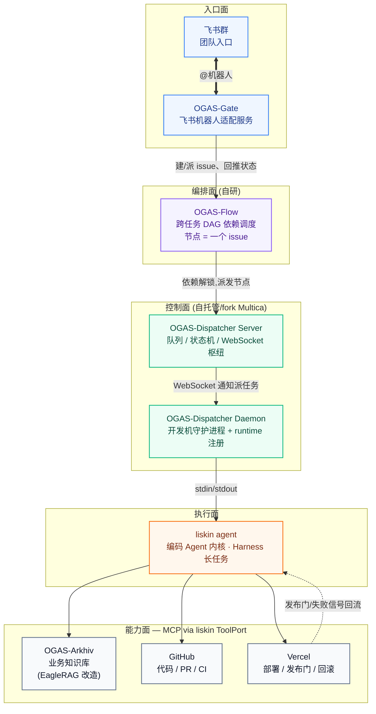
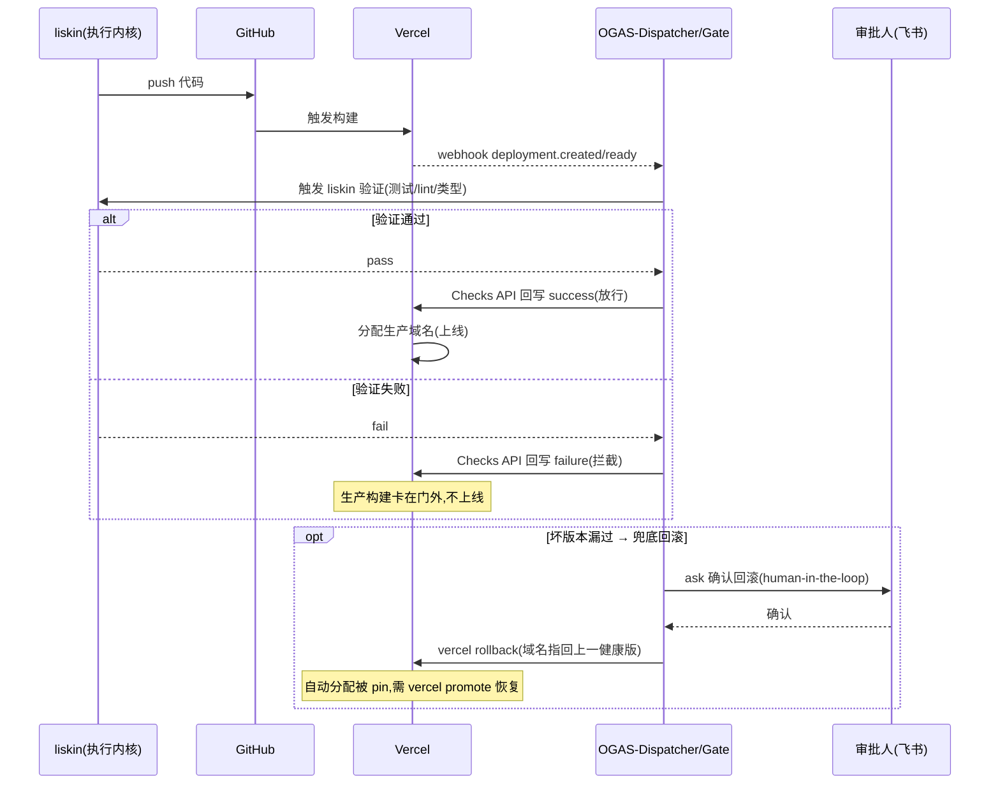
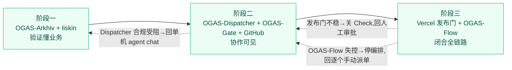

## 概述

# Agent 驱动的研发全链路协作平台

# RFC-0802: Glushkov-OGAS(Operational Generate Agent System)

> 项目 Glushkov ── OGAS,Operational Generate Agent System
> 状态 Draft
> 关联材料 项目sspecs(monorepo/spec 规范)、ADR-0001~0004

Glushkov-OGAS(Operational Generate Agent System,之后简称 OGAS )是一个自托管的 Agent 研发生命周期协作平台,让整个团队能以受控、可编排、可回滚的方式驱动 Agent,把一个需求从知识检索一路自动跑到代码交付和线上部署。

OGAS把团队开发机上的编码 Agent 作为服务统一暴露出去,让成员在飞书等im中能发起任务(OGAS-Gate),背后由控制平面(OGAS-Dispatcher)负责调度、队列和权限,由编排层(OGAS-Flow)把多个任务按依赖关系串成 DAG 执行,由知识库(OGAS-Arkhiv)提供业务知识检索,最终打通 GitHub 与 Vercel部署环节,打通上线和发布。

**OGAS(Operational Generate Agent System) 组件**

| OGAS 组件           | 角色                                                    | 底层/来源         |
| ------------------- | ------------------------------------------------------- | ----------------- |
| **OGAS-Dispatcher** | 控制面:任务队列、状态机、WebSocket 枢纽、开发机守护进程 | 上游 Multica      |
| **OGAS-Arkhiv**     | 知识面:业务知识库 MCP Server                            | 上游 EagleRAG     |
| **OGAS-Flow**       | 编排面:跨任务 DAG 依赖调度                              | 自研              |
| **OGAS-Gate**       | 入口面:飞书机器人适配服务                               | 自研              |
| **Liskin_Agent**    | 执行面:编码 Agent 内核                                  | 上游 Liskin_Agent |

---

## 一、背景与问题

在研发链路中，痛点集中在三处，分"Agent能力边界""团队协作""链路打通"三层：

- **第一，通用编码 Agent 往往在大型代码库里暴露同样的问题**：

    **「看不懂代码库、缺乏全局认知、回答跑偏」** "模型足够聪明,但它拿不到正确的上下文，Agent在实际开发中容易发生上下文过载(一次读入太多文件反而判断分散)、上下文不足(模块边界和领域术语,只能靠猜测推进)、以及搜索噪音[[1]](https://zhuanlan.zhihu.com/p/2043016346271839700)等等问题。关于Coding Agent大多数演示是从零搭一个简单的 Todo 类应用,而真实代码库是"有十五年历史、充满未文档化的隐性契约、蔓延到四十个文件的服务层"[[2]](https://tianpan.co/zh/blog/2026-04-19-ai-coding-agents-brownfield-legacy-code)。Anthropic 提出的解决方案是让"代码库需要适配 AI",而不是只靠模型[[3]](https://developer.aliyun.com/article/1737453)。但是在长期迭代历史悠久的大型代码仓库中，我们需要一种AI Agent适应代码的方案（关于AI友好架构这一点也有过论述，见作者博客 https://zhongye1.github.io/p/f77cee45/ ）

    **「生成代码不合规范、偏离业务逻辑、有幻觉」** AI 可能会生成"引用不存在的函数、使用想象出来的 API、语法正确但逻辑错误"的代码[[4]](https://arxiv.org/html/2404.00971v3)。业界普遍的应对叫法是"给 AI 制定 coding guidelines / 强制代码标准",把团队规范做成spec，喂给 Agent[[5]](https://blog.jetbrains.com/idea/2025/05/coding-guidelines-for-your-ai-agents/)，而我们要将这套方法论内化到Agent Core中。

    **「复杂任务接不住、跨模块多步骤难完成」** Agent容易出现"上下文腐烂(context rot)和跑偏(drift):比如前 20 个回合正常,到第 40 个回合 Agent 开始改不该改的文件、重复调用失败的工具、甚至忘了最初要解决的问题[[6]](https://www.tinyash.com/blog/mindlas-ai-agent-drift-problem/)。有时也有长上下文压缩导致任务链断裂"的问题[[7]](https://www.80aj.com/2026/07/23/ai-agent-context-compression/)。于是我们要给长任务 Agent 设计有效的 harness"[[8]](https://www.anthropic.com/engineering/effective-harnesses-for-long-running-agents)。

    **「质量缺乏反馈、开发者对产出没把握」** 在当前阶段，仍存在"AI 信任鸿沟(AI trust gap)"，而开发者往往期望在最少人工审查下把 AI 生成代码部署到生产"[[9]](https://stackoverflow.blog/2026/02/18/closing-the-developer-ai-trust-gap/)。Agent的运行过程与最终结果缺乏科学和客观的质量评估。

- **第二，Agent 的高自主性与不透明推理对传统可观测性方法构成了显著的挑战**[[10]](https://arxiv.org/html/2411.03455v3)。即便单个 Agent 好用，它也只是 "某个人在自己机器上跑的一个 loop": 任务不透明，团队其他人无法 review Agent 的执行链路。业界仍缺一个正式的过程模型来定义 Agent 之间及其与人类监督者如何贯穿整个研发生命周期协作[[11]](https://arxiv.org/pdf/2510.23664)。

- **第三,从 "需求" 到 "上线" 这条链路仍需要打通** ——Agent 擅长写代码，却只覆盖生命周期的一段，现有 SE Agent 大多是各自解决孤立子问题的 "专才", 缺一个把整条链路贯通的统一体[[12]](https://www.cs.purdue.edu/homes/lintan/publications/USEagent-icse26.pdf)。而恰恰是评审、CI、部署这些后期阶段，因其产出可通过可执行反馈客观评估，才是 Agent 最能落地的地方，工业界的普遍做法是把 Agent 动作限制在可验证、有边界的空间里[[13]](https://arxiv.org/html/2605.15245)；但今天这些环节的衔接仍靠人肉，没有一个把 issue、代码、部署串成闭环的编排机制，而这层工作流管理本身就是公认的开放难题[[14]](https://www.arxiv.org/pdf/2510.02557)。

## 二、关于设计目标

OGAS 目前期望就这一套架构达成共识:

**执行层**用 liskin_code_Agent 作为内核,通过它的 `ToolPort` 注入 OGAS-Arkhiv(业务知识)、GitHub(代码与 CI)、Vercel(部署)三类 MCP 能力;

**控制层**用 OGAS-Dispatcher 管理任务派给对应机器上的对应 Agent、具体到Agent的执行和状态";

**入口层**用 OGAS-Gate 把任务的创建、指派、状态回流搬进团队im群聊（如飞书）;

**编排层**用自研的 OGAS-Flow 支持多个任务按依赖前后串联执行。

OGAS 注重工程实践上的能力，目前暂不考虑模型侧;

OGAS-Dispatcher 底层目前设计可以参考 Multica 的守护进程、runtime 检测、任务状态机、WebSocket 实时流;

本 RFC 里目前不锁定具体的接口签名、数据表结构、prompt 内容,那些属于后续设计文档;

MVP不追求 cloud runtime——OGAS-Dispatcher 的 runtime 目前先是本地的,云端形态会在后续开始做;

通用工作流引擎 OGAS-Flow 的设计服务于"研发任务之间的依赖调度"窄场景。

## 三、现状

liskin 的架构已经为 "被外部调度" 做好了准备。它的 Kernel 与 Client 是解耦的，对外通过 agent exec 提供 headless 的无头执行模式，内部走 InProcessKernelClient, 天然适合被守护进程以 stdin/stdout 的方式驱动。

liskin 自带 Harness 长任务框架，任务状态落在 .liskin/harness/ 里，节点可中断、可恢复、可审计，这正好是我们做 "任务级容错" 想要的底座。其

Sandbox 用路径白名单加命令黑名单再叠加 auto/ask/deny 三档确认，给了我们在自动化链路里插入人工卡点的抓手。

liskin 的 MCP client 支持目前处于 Phase-1 进行中，对 GitHub/Vercel 的集成也标注为在建。这两块能力明确会做完，其完整形态对齐 pi agent 的能力边界 —— 也就是说，MCP 接入、GitHub/Vercel 的原生集成不是要不要有的问题，而是时间问题，终态可以参考 pi agent 已经跑通的形态来预期。我们的排期假设是在阶段二、阶段三可以放心地把这些能力算进 liskin 的既定路线，而不必自己造完整实现，只需在集成落地前用最小 shim 过渡。

EagleRAG 已经是一个成熟的 MCP Server, 提供 streamable HTTP 的 /mcp 端点和 stdio 两种接入方式，核心工具覆盖 ingest/query/retrieve, 并用 plugin_namespace 到 Milvus 的映射做多租户隔离。在当前的体系中，将它改造成 OGAS-Arkhiv, 主要是围绕权限和命名空间做团队化封装，底层检索能力可以直接复用。

Multica 是一个开源的 Go 平台，其形态可以作为我们想要的控制平面参考。它的 Server 负责协调、workspace/issue/ 队列 / 权限管理和 WebSocket hub, 明确不做模型推理也不做 Agent 执行；它的 Daemon 装在开发机上，扫描本地的 AI CLI、注册 runtime、在隔离工作区里调用工具并返回结果；Runtime 是 daemon 与某个 AI 工具的配对，目前只支持本地，云端在等候名单上。任务通过 WebSocket 下发，状态机是Queued→Dispatched→Running→Completed/Failed/Cancelled, 带 dispatch 五分钟、running 两个半小时的超时和可重试的失败处理，而且它原生就支持 pi runtime。唯一缺的，是跨任务的 DAG 编排 —— 这恰好是我们要自建的那一层。它以 Docker Compose、二进制或 K8s 自托管；

Vercel 这边，构建与发布是解耦的。它的 Deployment Checks 能以阻塞式检查的形式，在生产构建完成、域名分配之前把版本卡住，检查可以通过 GitHub Actions 或 Checks API 的 webhook (deployment.created/ready/succeeded/error) 来驱动。它的 Instant Rollback (vercel rollback [id|url]) 把域名指回上一个部署，不需要重新构建；但有个坑要注意，回滚之后自动分配会被关掉 (版本被 pin 住), 得用 vercel promote 才能恢复。目前的设计中，检查到底阻塞还是不阻塞，以及超时后放行还是拦截，都由开发者按项目自行配置。

## 四、设计方案

整体思路是控制面与执行面彻底分离,再在两端分别接上入口和编排,形成四层各司其职的结构。下图是 OGAS 的整体架构与数据流向,供评审对照:

**执行面以 liskin 为内核。** liskin 的关键价值在于它内核与外壳解耦,`LLMPort`/`ToolPort`/`StorePort` 三个端口让内核只跟抽象契约打交道,换模型、换工具来源、换存储都不动内核[[16]](https://raw.githubusercontent.com/Zhongye1/liskin_code_agent/main/Readme.md)。OGAS 正是利用 `ToolPort` 这一点,把三类外部能力作为 MCP 工具注入:OGAS-Arkhiv 作为业务知识库以 MCP Server 形态常驻,补上 liskin 自带的代码侧检索所缺的业务侧知识(PRD、接口契约、UI 规范、历史决策);GitHub 以 MCP 接入,让 Agent 能领 issue、开 PR、读 CI 结果;Vercel 以 MCP 接入负责部署。这些注入对上层完全透明——上层只知道"把任务派给某个 Agent",Agent 内部有多少业务知识和部署能力是执行面自己的事。

**控制面用 OGAS-Dispatcher。** 由三部分构成:Server 是协调中枢,管 workspace、issue、任务队列、成员权限,同时是 WebSocket 枢纽,但它本身不做任何模型推理、不执行任何 Agent 任务[[15]](https://notemi.cn/multica--integrating-ai-agents-into-team-collaboration-flow.html);Daemon 跑在开发机上,启动时扫描本地装了哪些 AI 工具、注册成 runtime,接到任务后建隔离工作目录、调用工具、回传结果;Runtime 是 daemon 与某个工具的配对。它跟 Agent 通信的底层就是 stdin/stdout——提示词写进进程、结果从 stdout 拿回,任务触发靠 WebSocket 通知后本地客户端拉取[[21]](https://blog.csdn.net/qq_63691275/article/details/162015817)。这跟 liskin 的 `agent exec` headless 一次性入口天然契合——daemon 把任务喂给 `liskin agent exec`,跑完吐回结果即可。值得一提的是其上游原生就支持 pi 作为 runtime[[22]](https://multica.ai/docs/install-agent-runtime),所以"liskin 或 pi"这个选择在接入层是可平替的。

**入口面用 OGAS-Gate 接入im。** 它是 OGAS-Dispatcher Server 之外的一个适配服务,一头连飞书事件回调、一头连 Dispatcher 的 API 和 WebSocket。团队成员在群里 @机器人 下达"让某 Agent 处理某 issue",OGAS-Gate 调 Dispatcher 建/派任务,Server 把任务派到对应 runtime,而 task 每次状态流转都推回飞书群。这样 Dispatcher 那条"人和 Agent 交错的活动时间线"就映射成了群消息,整个团队看得见 Agent 领了什么活、跑到哪、成功还是卡住,谁都能 review 执行链路并提建议——这正是把个人工具升级为团队协作的关键动作。

**编排面用自研的 OGAS-Flow,这也是设计上最需要克制的一层。** OGAS-Dispatcher 有的是"单个 issue 内的任务状态机"(Queued → Dispatched → Running → Completed/Failed/Cancelled,带超时与可重试分类)[[15]](https://notemi.cn/multica--integrating-ai-agents-into-team-collaboration-flow.html),但没有"跨任务的 DAG 编排"。

**部署环节是这套设计的重头。**我们把第一道防线放在**发布前拦截**。具体做法是把 liskin 的验证结果接到 Vercel 的 Deployment Checks 上,配成阻塞式检查:代码推上去、Vercel 构建完成后,在域名分配之前,先由 liskin 跑一轮验证(测试、lint、类型检查等),验证通过 check 才放行,不通过就把这个生产构建卡在门外,坏版本压根不会上线。整个交互是事件驱动的——Vercel 发出 deployment.created/ready 等 webhook,OGAS 这边接住、触发 liskin 验证、再把结论通过 Checks API 回写。

**回滚**是第二道防线,只在坏版本万一漏过时兜底。触发回滚走 `vercel rollback`,把域名瞬间指回上一个健康部署,不重新构建。但要在流程里显式记住那个坑:回滚后自动分配被 pin 住了,后续想恢复正常发布得走 `vercel promote`,这一步必须写进 runbook,否则下次部署会莫名其妙不生效。Check 的超时行为(超时放行还是拦截)允许各项目按风险等级自行配置,不做全局硬编码。

部署闭环的时序如下:

**最后OGAS-Flow 坐在 Dispatcher 之上**：维护一张 DAG,每个节点绑定一个 issue 和指定 Agent,节点的完成信号取自 Dispatcher 状态机的 Completed 事件,一个节点完成才解锁下游,失败则阻断或触发补偿分支。

## 五、相关事项

注意OGAS-Flow 的控制。在Agent core外自建一层 DAG,一旦分层没守住(比如让 OGAS-Flow 节点去干预 Agent 内部步骤,或把 Harness 状态当 DAG 状态),整套系统会变成一个难以调试的分布式状态泥潭。这是自研部分里技术风险最高的一块。权衡的结论是第一版刻意做窄——只做线性串联和简单依赖解锁,不上条件分支、并行汇聚、自动补偿回滚,等任务粒度和失败语义在真实使用中稳定后再扩。

注意部署自动化的安全边界。让 Agent 有能力触发生产回滚、promote 覆盖线上,本身是高危操作,叠加回滚后"钉住"部署的反直觉状态[[20]](https://vercel.com/docs/instant-rollback),如果确认档配置不当或 Agent 误判,可能造成线上服务对象错乱。解决方案是把这类动作硬性设为 ask 人工确认,并把 pinned 状态显式落盘、在飞书群里高亮告警。

注意端到端可观测性的缺口。OGAS 的链路又长(OGAS-Gate → OGAS-Flow → OGAS-Dispatcher → daemon → liskin → MCP 工具),一旦某个环节出问题,定位会很痛。这要求我们在自研部分就把结构化日志和 trace 串起来,而不是事后补。

## 六、推进计划

考虑到复杂度,OGAS 落地严格分三阶段推进,每阶段都有独立价值、可各自验收,任何一阶段不达标都可以停在原地而不影响已交付部分。

第一阶段先把执行面的核心假设跑通,不碰团队协作和编排。单独部署 OGAS-Arkhiv,把一个真实业务线的 PRD 和接口文档灌进去,用 liskin 的 `agent chat` 手动验证它能通过 MCP 查到并用上这些业务知识。这一阶段只回答"Agent 懂不懂业务"这一个问题,主要工作量在给 liskin 补 `ToolPort` 的 MCP client 实现——这是它路线图里"价值最大但尚未交付"的一项[[16]](https://raw.githubusercontent.com/Zhongye1/liskin_code_agent/main/Readme.md)。验收标准是 Agent 生成的代码显著贴合业务规范。

第二阶段接入控制面和团队入口,让协作可见。自托管 OGAS-Dispatcher,把 liskin 接成一个 runtime,再接 GitHub MCP 让 Agent 从 issue 领任务、开 PR,同时上 OGAS-Gate 把任务创建和状态回流搬进群。这一阶段验收的是"团队在群里能看见并指派 Agent 干活",还不涉及跨任务编排,也不接生产部署。

第三阶段打通部署与编排,闭合全链路。接 Vercel,把 liskin 的验证接成 Deployment Checks 发布门、把回滚设为人工确认的应急手段;同时上线第一版窄范围的 OGAS-Flow(仅线性串联)。这一阶段验收的是"一串有依赖的任务能自动跑完并安全上线"。

三阶段的推进与回滚关系如下:

## 七、待决问题

有几个问题需要在评审中或评审后明确,它们会实质影响方案的可行性和排期。

OGAS-Dispatcher 底层(Multica)的自托管能否满足内网的安全与合规要求,是最硬的前置问题——它虽然宣称数据不出网、每行代码可审计[[17]](https://www.multica.ai/),但其许可证为 NOASSERTION(非标准开源许可),商用和二次开发的合规性需要法务确认,这直接决定备选一(完全自研)会不会被迫成为唯一选项。

执行机的形态需要拍板:是人手一台常驻开发机各跑守护进程,还是内网集中搭几台专用执行机?后者的资源隔离、多任务抢占、运维归属都要有人认领。

OGAS-Flow 是完全从零写,还是基于某个成熟的轻量工作流库改造以降低失控风险?第一版的窄范围(仅线性串联)具体窄到什么程度,需要和实际业务场景对齐。

OGAS-Gate 的交互协议需要定义:哪些操作允许在群里直接触发(建 issue、指派、查状态大概率可以),哪些高危操作(触发生产回滚、promote)必须跳转到有更强身份校验的界面而非群消息一句话搞定。

最后是 liskin 本身的成熟度依赖——它的 MCP client、GitHub/Vercel 全链路集成目前都还标注为"在建"[[16]](https://raw.githubusercontent.com/Zhongye1/liskin_code_agent/main/Readme.md)。我们是等它上游合入,还是自己 fork 补齐这几段?这关系到第一、三阶段的实际起点和排期,需要尽早决策。

---

## References

1. [面向大型代码库的 Claude Code 团队落地经验](https://zhuanlan.zhihu.com/p/2043016346271839700)
2. [AI 编码智能体在遗留代码库上的实践](https://tianpan.co/zh/blog/2026-04-19-ai-coding-agents-brownfield-legacy-code)
3. [Claude Code 在大型代码库里的工程实践](https://developer.aliyun.com/article/1737453)
4. [Exploring Hallucinations in LLM-Generated Code](https://arxiv.org/html/2404.00971v3)
5. [Coding Guidelines for Your AI Agents](https://blog.jetbrains.com/idea/2025/05/coding-guidelines-for-your-ai-agents/)
6. [Mindlas 实时捕捉上下文腐烂](https://www.tinyash.com/blog/mindlas-ai-agent-drift-problem/)
7. [AI Agent 落地痛点:长上下文压缩导致任务链断裂](https://www.80aj.com/2026/07/23/ai-agent-context-compression/)
8. [Effective harnesses for long-running agents](https://www.anthropic.com/engineering/effective-harnesses-for-long-running-agents)
9. [Closing the AI trust gap for developers](https://stackoverflow.blog/2026/02/18/closing-the-developer-ai-trust-gap/)
10. [Agentic AI 可观测性](https://arxiv.org/html/2411.03455v3)
11. [Agent 协作过程模型](https://arxiv.org/pdf/2510.23664)
12. [USEagent: Unified Software Engineering Agent](https://www.cs.purdue.edu/homes/lintan/publications/USEagent-icse26.pdf)
13. [工业界 Agent 落地实践](https://arxiv.org/html/2605.15245)
14. [Agent 工作流管理](https://www.arxiv.org/pdf/2510.02557)
15. [Multica:把 AI Agent 真正接入团队协作流](https://notemi.cn/multica--integrating-ai-agents-into-team-collaboration-flow.html)
16. [Readme.md](https://raw.githubusercontent.com/Zhongye1/liskin_code_agent/main/Readme.md)
17. [Multica — Project Management for Human + Agent Teams](https://www.multica.ai/)
18. [Deployment Checks](https://vercel.com/docs/deployment-checks)
19. [vercel rollback](https://vercel.com/docs/cli/rollback)
20. [Instant Rollback](https://vercel.com/docs/instant-rollback)
21. [Multica:多机器多 Agent 任务管理](https://blog.csdn.net/qq_63691275/article/details/162015817)
22. [Install an agent runtime](https://multica.ai/docs/install-agent-runtime)
