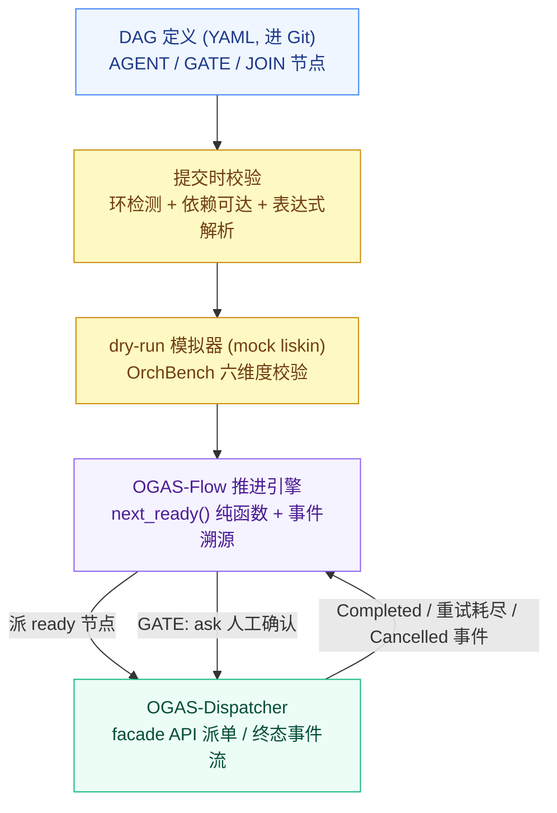
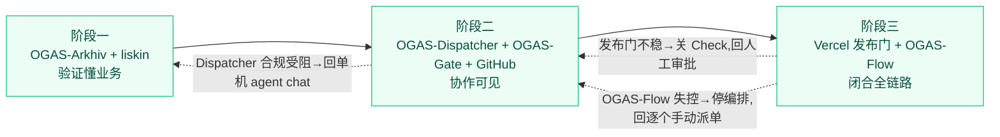

# RFC-0802: OGAS (Operational Generate Agent System)

> 项目 Glushkov ── OGAS, Operational Generate Agent System

> 状态 Draft

> 关联材料 项目 specs(monorepo/spec 规范)、ADR-0001~0004

---

## 概述

OGAS（Operational Generate Agent System，以下简称 OGAS）是一个自托管的 Agent 研发生命周期协作平台。它让整个团队能以受控、可编排、可回滚的方式驱动 Agent，从一个需求的知识检索，一路自动推进到代码交付和线上部署。

当前研发链路中的痛点集中在三处：单个编码 Agent 虽然好用，但它只是"某个人在自己机器上跑的一个 loop"，团队其他人无法 review 执行链路；多个任务之间有先后依赖，但没有编排机制将它们串联起来自动执行；从代码到部署之间，评审、CI、部署这些可验证环节仍靠人肉衔接，没有形成闭环。OGAS 正是为了打通这三个缺口而设计的。

OGAS 由五个组件构成，分别覆盖入口、编排、控制、执行和能力五个层面：

**OGAS 组件总览**

| OGAS 组件           | 角色                                                     | 底层/来源         |
| ------------------- | -------------------------------------------------------- | ----------------- |
| **OGAS-Gate**       | 入口面：飞书机器人适配服务                               | 自研              |
| **OGAS-Flow**       | 编排面：跨任务 DAG 依赖调度                              | 自研              |
| **OGAS-Dispatcher** | 控制面：任务队列、状态机、WebSocket 枢纽、开发机守护进程 | 上游 Multica      |
| **Liskin_Agent**    | 执行面：编码 Agent 内核                                  | 上游 Liskin_Agent |
| **OGAS-Arkhiv**     | 知识面：业务知识库 MCP Server                            | 上游 EagleRAG     |

---

## 背景与问题

研发链路中的痛点可以分三层来看，分别对应 Agent 的能力边界、团队协作方式和链路打通程度。

### 1.1 执行面：单个编码 Agent 的能力边界

通用编码 Agent 在大型代码库上会暴露出一组相似的问题。模型本身足够聪明，但它拿不到正确的上下文——要么一次读入太多文件导致判断分散，要么模块边界和领域术语只能靠猜测推进，搜索过程中又充满噪音[[1]](https://zhuanlan.zhihu.com/p/2043016346271839700)。Coding Agent 的大多数演示是从零搭建一个简单的 Todo 类应用，而真实代码库往往是"有十五年历史、充满未文档化的隐性契约、蔓延到四十个文件的服务层"[[2]](https://tianpan.co/zh/blog/2026-04-19-ai-coding-agents-brownfield-legacy-code)。Anthropic 提出的方向是让"代码库适配 AI"而不是只靠模型[[3]](https://developer.aliyun.com/article/1737453)，但在长期迭代、历史包袱重的大型仓库中，我们更需要一种让 AI Agent 主动适应现有代码的方案（这一点在作者博客中有过专门论述 https://zhongye1.github.io/p/f77cee45/）。

生成代码的质量同样堪忧。AI 可能引用不存在的函数、使用想象出来的 API、或者写出语法正确但逻辑错误的代码[[4]](https://arxiv.org/html/2404.00971v3)。业界常见的做法叫"给 AI 制定 coding guidelines"，把团队规范做成 spec 喂给 Agent[[5]](https://blog.jetbrains.com/idea/2025/05/coding-guidelines-for-your-ai-agents/)。我们要做的是把这套方法论内化到 Agent 内核中，而不是外挂一份规范文档了事。

复杂任务的长程执行是另一个难题。Agent 容易出现上下文腐烂（context rot）和跑偏（drift）：前 20 个回合一切正常，到第 40 个回合 Agent 开始改不该改的文件、重复调用失败的工具、甚至忘了最初要解决什么问题[[6]](https://www.tinyash.com/blog/mindlas-ai-agent-drift-problem/)。长上下文压缩也可能导致任务链断裂[[7]](https://www.80aj.com/2026/07/23/ai-agent-context-compression/)。针对这些问题，需要为长任务 Agent 设计有效的 harness[[8]](https://www.anthropic.com/engineering/effective-harnesses-for-long-running-agents)。

最后是质量反馈的缺失。当前阶段仍存在"AI 信任鸿沟"——开发者希望以最少的人工审查将 AI 生成代码部署到生产，但 Agent 的运行过程和最终结果都缺乏科学、客观的质量评估[[9]](https://stackoverflow.blog/2026/02/18/closing-the-developer-ai-trust-gap/)。

### 1.2 协作面：Agent 高自主性带来的团队可见性缺失

Agent 的高自主性与不透明推理对传统可观测性方法构成了显著挑战[[10]](https://arxiv.org/html/2411.03455v3)。即便单个 Agent 好用，它本质上只是"某个人在自己机器上跑的一个 loop"——任务不透明，团队其他人无法 review Agent 的执行链路，也无法知道它为什么做了某个决策。业界至今缺少一个正式的过程模型来定义 Agent 之间及其与人类监督者如何贯穿整个研发生命周期协作[[11]](https://arxiv.org/pdf/2510.23664)。这就意味着，Agent 的能力再强，也停留在个人工具的层面，无法升级为团队协作的基础设施。

### 1.3 链路面：从需求到上线各环节未打通

Agent 擅长写代码，但它只覆盖了生命周期的一段。现有软件工程 Agent 大多是各自解决孤立子问题的"专才"，缺少一个把整条链路贯通的统一体[[12]](https://www.cs.purdue.edu/homes/lintan/publications/USEagent-icse26.pdf)。然而恰恰是评审、CI、部署这些后期阶段，因其产出可以通过可执行反馈客观评估，才是 Agent 最能落地的地方；工业界的普遍做法是把 Agent 动作限制在可验证、有边界的空间里[[13]](https://arxiv.org/html/2605.15245)。但今天这些环节的衔接仍然靠人肉——issue 到代码、代码到 PR、PR 到 CI、CI 到部署，每一步都需要人手动触发，没有一个把 issue、代码、部署串成闭环的编排机制，而这层工作流管理本身就是公认的开放难题[[14]](https://www.arxiv.org/pdf/2510.02557)。

---

## 设计目标

### 2.1 功能目标

这套架构要让团队能做到以下三件事：

第一，团队成员在 IM（飞书）中发起任务时，Agent 自动执行并实时回流状态——从任务创建、指派到运行进展、终态结果，整个团队在群里看得见、可 review。

第二，多个有依赖关系的任务能按 DAG 自动串联执行。一个任务完成并解锁下游后，下游任务自动派发，不需要人手动衔接。

第三，部署环节有发布门拦截。代码推上去之后，Vercel 构建完成、域名分配之前，先由 liskin 跑一轮验证（测试、lint、类型检查），验证通过才放行，不通过就把坏版本卡在门外。

### 2.2 架构约束

以下约束贯穿全部设计决策，在任何阶段都不得违反：

- **控制面与执行面分离**：Dispatcher 只做调度和状态跟踪，不碰代码、不碰密钥、不碰 prompt 内容。
- **编排层保持确定性**：OGAS-Flow 不调用 LLM、不含随机数、不介入 Agent 内部推理，节点之间的推进完全确定。
- **高危操作必须人工确认**：生产回滚、promote 等动作硬性设为 ask 确认，不允许 Agent 自主完成。
- **自托管，数据不出内网**：所有组件自托管部署，不依赖外部 SaaS 托管控制面。

### 2.3 非目标

为明确范围，以下事项不在本 RFC 的设计范围内：

- **不自研编码 Agent 内核**：执行面使用 liskin，不自行开发 Agent 推理内核。
- **Dispatcher 不做模型推理**：控制面只做调度，不做任何模型调用。
- **不做云端 runtime**：MVP 阶段只支持本地开发机上的 runtime，云端执行暂不涉及。
- **不锁定接口签名和数据表结构**：本 RFC 只做架构设计，具体接口、schema、prompt 内容属于后续设计文档。

---

## 现状与依赖

本节逐个梳理 OGAS 所依赖的五个上游组件或平台，统一按"现有能力 → 缺什么 → 对 OGAS 的意义"三段来写。

### 3.1 执行面：Core_Agent_Runtime

目前 liskin（作者自建，设计思想参考pi） 是 OGAS 的 Agent 执行内核，后续会考虑通过SDK支持其他SOTA Agent（claude code，codex）liskin 的项目地址：https://github.com/Zhongye1/liskin_code_agent

**现有能力。** liskin 的架构已经为"被外部调度"做好了准备。它的 Kernel 与 Client 是解耦的，对外通过 `agent exec` 提供 headless 的无头执行模式，内部走 InProcessKernelClient，天然适合被守护进程以 stdin/stdout 的方式驱动。liskin 自带 Harness 长任务框架，任务状态落在 `.liskin/harness/` 目录里，节点可中断、可恢复、可审计——这正是任务级容错想要的底座。其 Sandbox 用路径白名单加命令黑名单，再叠加 auto/ask/deny 三档确认，给了在自动化链路里插入人工卡点的抓手。liskin 的内核与外壳解耦体现在三个端口上：`LLMPort`/`ToolPort`/`StorePort`，内核只跟抽象契约打交道，换模型、换工具来源、换存储都不动内核[[15]](https://raw.githubusercontent.com/Zhongye1/liskin_code_agent/main/Readme.md)。OGAS 正是利用 `ToolPort` 这一点，把外部能力作为 MCP 工具注入。

**在建能力。** liskin 的 MCP client 支持目前处于 Phase-1 进行中，对 GitHub/Vercel 的集成也标注为在建。这两块能力明确会做完，其完整形态对齐 pi agent 的能力边界。也就是说，MCP 接入、GitHub/Vercel 的原生集成不是要不要有的问题，而是时间问题。排期假设是在阶段二、阶段三可以放心地把这些能力算进 liskin 的既定路线，不必自己造完整实现，只需在集成落地前用最小 shim 过渡。

**对 OGAS 的意义。** liskin 为 OGAS 提供了执行面的全部基础：headless 模式让 Daemon 可以用进程方式驱动它；Harness 框架让长任务可中断可恢复；Sandbox 三档确认让高危操作可以拦截；三个端口让外部能力可以透明注入。OGAS 不需要修改 liskin 内核，只需在集成层做适配。

### 3.2 知识面：EagleRAG

**现有能力。** EagleRAG 已经是一个成熟的 MCP Server，提供 streamable HTTP 的 `/mcp` 端点和 stdio 两种接入方式。核心工具覆盖 ingest/query/retrieve，并用 plugin_namespace 到 Milvus 的映射做多租户隔离。

**缺什么。** EagleRAG 当前是面向通用场景的知识检索服务，缺少面向团队协作的权限管理和命名空间封装。在 OGAS 中，不同业务线的 PRD、接口契约、UI 规范需要隔离，团队成员的检索权限需要按 workspace 区分。

**对 OGAS 的意义。** 将它改造成 OGAS-Arkhiv，主要是围绕权限和命名空间做团队化封装，底层检索能力可以直接复用。改造工作量不大，不需要改动 EagleRAG 的核心检索引擎。

### 3.3 控制面：Multica

**现有能力。** Multica 是一个开源的 Go 平台[[24]](https://www.multica.ai/)，其形态可以作为控制平面底座。它的 Server 负责协调、workspace/issue/队列/权限管理和 WebSocket hub，明确不做模型推理也不做 Agent 执行[[16]](https://notemi.cn/multica--integrating-ai-agents-into-team-collaboration-flow.html)。它的 Daemon 装在开发机上，扫描本地的 AI CLI、注册 runtime、在隔离工作区里调用工具并返回结果。Runtime 是 daemon 与某个 AI 工具的配对，目前只支持本地，云端在等候名单上。任务通过 WebSocket 下发，状态机是 Queued → Dispatched → Running → Completed/Failed/Cancelled，带 dispatch 五分钟、running 两个半小时的超时和可重试的失败处理，而且它原生就支持 pi runtime[[17]](https://multica.ai/docs/install-agent-runtime)。它以 Docker Compose、二进制或 K8s 自托管。

**缺什么。** 唯一缺的是跨任务的 DAG 编排——这恰好是 OGAS-Flow 要自建的那一层。此外，Multica 假设的是全自主执行，没有 human-in-the-loop 的 ask 通道，而 OGAS 要求生产回滚、promote 这类高危动作必须人工确认。

**对 OGAS 的意义。** Multica 的 Server/Daemon 双进程结构、任务状态机、WebSocket 枢纽正好是控制面需要的东西。fork Multica 后，改动集中在五处（详见第四节 4.2），不侵入核心调度路径，方便周期性 rebase 上游。但有一个前置合规风险：Multica 的许可证为 NOASSERTION（非标准开源许可），商用和二次开发的合规性需要法务确认，这直接决定 fork 路线是否成立。

### 3.4 部署面：Vercel

**现有能力。** Vercel 的构建与发布是解耦的。它的 Deployment Checks 能以阻塞式检查的形式，在生产构建完成、域名分配之前把版本卡住，检查可以通过 GitHub Actions 或 Checks API 的 webhook（deployment.created/ready/succeeded/error）来驱动。它的 Instant Rollback（`vercel rollback [id|url]`）把域名指回上一个部署，不需要重新构建[[18]](https://vercel.com/docs/instant-rollback)。检查到底阻塞还是不阻塞，以及超时后放行还是拦截，都由开发者按项目自行配置。

**缺什么 / 需要注意的坑。** 回滚之后自动分配会被关掉——版本被 pin 住，后续想恢复正常发布得走 `vercel promote` 才能恢复。这一步在流程里必须显式记住，否则部署会莫名其妙不生效。

**对 OGAS 的意义。** Vercel 的 Deployment Checks 天然适合做成 OGAS-Flow 里的 GATE 节点：构建完成后触发 liskin 验证，验证结果通过 Checks API 回写，通过则放行上线，不通过则拦截。回滚作为兜底手段，由人工确认后触发。

### 3.5 编排面：学术与工业参考

关于编排层怎么工程化实现，近期的学术与工业工作给出了相当一致的方向，以下四条结论共同支撑了 OGAS-Flow 的设计取向：

- **Agint** 把软件工程任务先编译成图再执行，主张即便 AI 步骤不确定、图的执行也要保持确定，并用 SHIM 节点做"含 AI 组件却仍确定性推进"的混合执行[[19]](https://www.arxiv.org/pdf/2511.19635)。
- **微软 Conductor** 论证了"结构已知的工作流不该让 LLM 动态路由"，而应把编排做成声明式、确定性、消耗零 token 的一层，并把执行、上下文流转、人工监督显式拆开[[20]](https://opensource.microsoft.com/blog/2026/05/14/conductor-deterministic-orchestration-for-multi-agent-ai-workflows/)。
- **OrchBench** 给出了"把编排计划从执行中剥离、用确定性模拟单独评估"的方法，沿结构、覆盖、缺失子任务、依赖正确性、冗余、并行合理性六个维度检验 DAG[[21]](https://arxiv.org/html/2607.25656v1)。
- **Temporal / durable execution** 的成熟做法是用事件历史确定性重放来替代手搓状态机，实现崩溃恢复[[22]](https://temporal.io/blog/temporal-replaces-state-machines-for-distributed-applications)。

这四条结论的共识是：编排的确定性部分和 Agent 的非确定性部分要彻底分开，不确定性全部关进节点内部，节点之间的推进保持确定、零推理、可单独验证。OGAS-Flow 逐条落地这四点，具体设计见第四节 4.4。

---

## 任务派发流程设计

OGAS 的任务派发流程横跨五个组件，整条链路是**飞书群 → Gate 翻译 → Flow 编排 → Dispatcher 派发 → Daemon 拉起 liskin → MCP 工具执行 → 结果原路回流 → Flow 解锁下游 → Gate 推回群里**


### 第一步：任务发起（飞书群 → OGAS-Gate）

团队成员在飞书群里 @机器人，用自然语言下达指令——比如"让 liskin-frontend 实现登录页"。OGAS-Gate 作为 IM 适配服务，接住飞书的事件回调，把群聊指令翻译成 Dispatcher 的 REST API 调用：创建 issue、指派 Agent、设定任务参数。Gate 不直连 Multica 内部数据表，而是走 Dispatcher 的 API facade 层（见 RFC 4.2 第四层改动），这样上游 schema 变化时只影响适配层。

如果任务属于某个 DAG 的一部分，Gate 还会通知 OGAS-Flow 有新节点需要编排。

### 第二步：DAG 编排（OGAS-Flow → OGAS-Dispatcher）

OGAS-Flow 拿到 DAG 定义后，调用纯函数 `next_ready(dag, completed_set)` 计算当前哪些节点的前驱已全部完成、可以派发。这个函数是确定性的——不调用 LLM、不含随机数，给定相同输入永远输出相同结果。

对于刚启动的 DAG，入口节点没有前驱依赖，立刻进入 ready 状态。Flow 把 ready 节点对应的 issue 派发指令发给 Dispatcher："把这个 issue 派给 liskin-frontend runtime"。Flow 自己不执行任何代码，只做图推进。

### 第三步：任务派发（Dispatcher Server → Daemon）

Dispatcher Server 收到派发指令后，查到 liskin-frontend runtime 注册在哪台开发机上，通过 WebSocket 通知那台机器上的 Daemon。

任务状态机随之流转：**Queued → Dispatched**。Dispatcher 有超时规则——派发后 5 分钟内 Daemon 必须接单（拉起进程），否则判超时；进入 Running 后有指定小时的执行窗口。瞬时失败（比如进程崩溃）由 Dispatcher 自己重试，重试耗尽后才向上层发出一个可区分的"重试已耗尽"终态，而不是普通 Failed。

Dispatcher 全程不碰代码、不碰密钥、不碰 prompt 内容。GitHub token、Vercel token、Arkhiv 的 MCP 端点都配在 Agent 级的 `custom_env` 里，Daemon 在 spawn 进程时原样透传，Dispatcher 只是转发。

### 第四步：Agent 执行（Daemon → liskin）

Daemon 收到 WebSocket 通知后，在隔离工作目录里拉起 `liskin agent exec` 进程。任务描述通过 stdin 写入，结果从 stdout 拿回。Daemon 只管进程生命周期——拉起、喂提示词、收结果，不管 kernel 内部状态。liskin 的 Harness 框架自管内部的任务节点状态（落在 `.liskin/harness/` 目录里），这两层状态刻意解耦。

liskin 在执行过程中通过 `ToolPort` 调用三类 MCP 工具：

- **OGAS-Arkhiv**：查询 PRD、接口契约、UI 规范等业务知识
- **GitHub MCP**：领 issue、读代码、开 PR、查 CI 结果
- **Vercel MCP**：触发部署、查询部署状态

这些工具调用对上层完全透明，Dispatcher 不感知 Agent 在用什么工具，Flow 同理。

### 第五步：结果回流与下游解锁

liskin 执行完毕后，结构化结果从 stdout 返回给 Daemon，Daemon 回传给 Server，任务状态流转为 **Completed / Failed / Cancelled**。

这条终态事件同时推给两个消费者：

- **OGAS-Flow**：消费 Completed 事件，把该节点加入已完成集合，重新调用 `next_ready` 计算下游是否有新节点解锁。如果有，立刻把下游节点派发给 Dispatcher——整个链路自动推进，不需要人手动衔接。
- **OGAS-Gate**：把状态流转翻译成飞书群消息推回给团队。回流粒度可配置（全量模式 / 终态模式 / 混合模式），让团队看得见 Agent 跑到了哪一步。

如果进程崩溃，Dispatcher 重启后，Flow 不需要从 checkpoint 恢复——把 Dispatcher 的终态事件流重放一遍就能重建当前的已完成集合，再调用 `next_ready` 继续推进。这就是事件溯源的基本思路。

### 旁路：高危操作的人工确认通道

当 liskin 的 Sandbox 遇到 ask 档操作（比如生产回滚、promote），原本单向的"派任务—回结果"链路会切换成双向交互子通道：

liskin 抛出 ask 提示 → Daemon 通过 WebSocket 上报 Server → Server 推给 Gate → Gate 在飞书群里高亮告警。但实际的确认动作不在群消息里完成——成员需要跳转到有更强身份校验的界面（比如飞书内嵌 H5 审批页）。确认后，决策沿原路回灌：Gate → Server → Daemon → liskin 的 stdin，Agent 继续执行或终止。

这条 ask 通道复用现有的 WebSocket 连接基础设施，是原生 Multica 没有、OGAS 必须加的一段设计。

---

## 工程方案

本 RFC 不锁定具体的接口签名、数据表结构和 prompt 内容，后续设计文档会详细说明。

整体思路是控制面与执行面彻底分离，再在两端分别接上入口和编排，形成四层各司其职的结构。各组件统一遵循"是什么 → 输入输出 → 设计细节 → 边界约束"的叙述框架，以下逐层展开。

### 4.0 架构总览

OGAS 的四层架构如下：

- **入口面（OGAS-Gate）**：连接飞书群聊和 Dispatcher，是团队成员发起任务的统一入口。
- **编排面（OGAS-Flow）**：维护 DAG 依赖关系，消费 Dispatcher 的任务终态事件，按依赖解锁下游节点。
- **控制面（OGAS-Dispatcher）**：中心化任务调度器，把任务派到正确的开发机和 Agent 上，跟踪状态，不做模型推理。
- **执行面（liskin + MCP 工具）**：编码 Agent 内核，通过 ToolPort 注入业务知识库、GitHub、Vercel 三类 MCP 能力。

核心设计原则是**控制面与执行面分离**：Dispatcher 只做调度和状态跟踪，永远不碰代码、不碰密钥、不碰 prompt 内容；编排层保持确定性，不介入 Agent 内部推理。这条原则贯穿所有设计决策，后面每一层的设计都建立在这个前提上。

### 4.1 执行面：liskin


liskin 是 OGAS 的编码 Agent 执行内核。它在系统中的角色是"被 Dispatcher 驱动的编码引擎"——收到任务后自主完成代码编写、测试、提交，完成后返回结构化结果。

#### 输入输出

输入是 Dispatcher Daemon 通过 stdin 写入的任务描述（提示词），输出是 stdout 返回的结构化执行结果。Agent 在执行过程中可以通过 ToolPort 调用三类 MCP 工具：OGAS-Arkhiv（业务知识检索）、GitHub（代码操作 / PR / CI 结果读取）、Vercel（部署触发与状态查询）。

#### 设计

liskin 的关键价值在于内核与外壳解耦。`LLMPort`/`ToolPort`/`StorePort` 三个端口让内核只跟抽象契约打交道，换模型、换工具来源、换存储都不动内核[[15]](https://raw.githubusercontent.com/Zhongye1/liskin_code_agent/main/Readme.md)。OGAS 利用 `ToolPort` 把三类外部能力作为 MCP 工具注入：

- **OGAS-Arkhiv** 作为业务知识库以 MCP Server 形态常驻，补上 liskin 自带的代码侧检索所缺的业务侧知识——PRD、接口契约、UI 规范、历史决策。
- **GitHub** 以 MCP 接入，让 Agent 能领 issue、开 PR、读 CI 结果。
- **Vercel** 以 MCP 接入，负责部署触发与状态查询。

这些注入对上层完全透明——上层只知道"把任务派给某个 Agent"，Agent 内部有多少业务知识和部署能力是执行面自己的事。

liskin 自带的 Harness 长任务框架是任务级容错的底座。任务状态落在 `.liskin/harness/` 目录里，节点可中断、可恢复、可审计。这意味着 Daemon 只需要管进程生命周期（拉起 `liskin agent exec`、通过 stdin 喂提示词、从 stdout 拿结果），不需要管 kernel 内部状态——kernel 状态由 Harness 框架自管。

liskin 的 Sandbox 用路径白名单加命令黑名单，再叠加 auto/ask/deny 三档确认。auto 档自动放行安全操作，deny 档直接拒绝危险操作，ask 档把决策抛回给调用方。在 OGAS 中，ask 档被串联到 Daemon → Server → Gate → 飞书群的双向通道，最终由人在群里确认（详见 4.2 的 ask 通道设计和 4.3 的 Gate 交互协议）。

#### 边界约束

liskin 的 Harness 状态（`.liskin/harness/` 里的节点状态）是执行面内部的容错机制，不等于 Dispatcher 的任务状态。Dispatcher 只看到"这个 task 在 running / 完成了"，liskin 内部跑了多少步、中断恢复了多少次，是它自己的事。这两层状态必须解耦，否则系统会退化成分布式状态泥潭。这一约束在第五节风险分析中有更详细的讨论。

### 4.2 控制面：OGAS-Dispatcher


OGAS-Dispatcher 是中心化任务调度器。它解决的问题是：团队里有多台开发机、多个 Agent 实例，需要一个中心组件把任务派到正确的机器、正确的 Agent 上，并跟踪每个任务跑到了哪一步。Dispatcher 自己不做任何模型推理、不执行任何代码、不接触密钥和 prompt 内容——这条边界是后续所有设计的前提。

**输入输出。** Dispatcher 对上给 OGAS-Flow 提供任务状态事件（Completed / Failed / Cancelled），对旁给 OGAS-Gate 提供建/派/查 issue 的 API，对下通过 Daemon 把任务派给 liskin 执行。

#### 构成

Dispatcher 由三部分构成：

- **Server**：协调中枢。管 workspace（工作空间，映射到团队或项目）、issue（任务实体，一个 issue = 一次 liskin exec 调用）、任务队列、成员权限，同时是 WebSocket 枢纽。Server 跑在中心节点上，所有任务创建、派发、状态流转都经过它。
- **Daemon**：开发机守护进程。安装在每台开发机上，启动时扫描本地安装了哪些 AI CLI 工具、注册成 runtime，接到任务后建隔离工作目录、调用工具、回传结果。Daemon 与 Agent 通信的底层是 stdin/stdout——提示词写进进程、结果从 stdout 拿回，任务触发靠 WebSocket 通知后本地客户端拉取[[23]](https://blog.csdn.net/qq_63691275/article/details/162015817)。
- **Runtime**：Daemon 与某个 AI 工具的配对。一台机器上装了 liskin，就注册成一个 liskin runtime；装了 pi，就注册成一个 pi runtime。一个 runtime = 一台机器上的一个 Agent 执行单元。目前只支持本地 runtime，云端在等候名单上。

#### 职责边界与设计

Multica 的 Server 有一条硬约束：它只做协调、workspace/issue/队列/权限管理和 WebSocket hub，本身不做任何模型推理、不执行任何 Agent 任务[[16]](https://notemi.cn/multica--integrating-ai-agents-into-team-collaboration-flow.html)。OGAS-Dispatcher 原样继承这条边界。具体来说：

**Dispatcher 做什么：**

- 任务派发：把任务派到对应 runtime（开发机上的 Agent 实例）
- 状态跟踪：维护任务状态机（Queued → Dispatched → Running → Completed/Failed/Cancelled）
- 事件推送：把状态流转事件推给 OGAS-Flow 和 OGAS-Gate
- 权限管理：管理 workspace 成员和任务权限

**Dispatcher 不做什么：**

- 不碰代码——代码在 Agent 进程里，Dispatcher 只是转发任务
- 不碰密钥——GitHub token、Vercel token 通过 Daemon 的环境变量透传给 Agent，Dispatcher 看不到
- 不碰 prompt 内容——提示词由 Gate/Flow 生成或由 issue 模板提供，Dispatcher 只做转发
- 不做编排——跨任务 DAG 是 OGAS-Flow 的职责，Dispatcher 只提供单 issue 状态机这块原子能力

平面底座的设计目标参考Multica，如Server/Daemon 双进程结构、任务状态机、WebSocket 枢纽等。改动集中在适配层和扩展层。

fork 的改动集中在以下四处，按层次组织：

**第一层：基本集成——把 liskin 注册成一个 runtime。**

这是 fork 的核心工作。Multica 的 Daemon 启动时会扫描 PATH 上的 AI CLI 并注册成 runtime，而且其上游原生就支持 pi 作为 runtime[[17]](https://multica.ai/docs/install-agent-runtime)。liskin 的 `agent exec` 是一个 headless、一次性的 stdin/stdout 入口，内部走 InProcessKernelClient，这跟 Daemon 驱动 pi 的方式在结构上是同一类东西。所以最省事的做法是照着 pi 的 runtime adapter 仿一个 liskin provider：Daemon 拉起 `liskin agent exec`，把提示词写进 stdin，从 stdout 拿回结构化结果。因为 liskin 的 Kernel 与 Client 解耦、headless 模式自管内核生命周期，Daemon 只需要管进程生命周期，不需要管 kernel 状态。MVP 阶段可以先用一个薄 shim 让 liskin"看起来像"一个已支持的 provider 过渡，等 liskin 上游把 MCP client 补齐再切正式集成。

**第二层：编排接入——状态事件引出给 Flow。**

Multica 的状态机（Queued → Dispatched → Running → Completed/Failed/Cancelled）、超时规则（dispatch 5 分钟、running 2.5 小时）、失败可重试分类全部原样保留[[16]](https://notemi.cn/multica--integrating-ai-agents-into-team-collaboration-flow.html)。fork 要加的是：让每一次状态流转都发出一个可订阅的事件，OGAS-Flow 的节点完成信号就取自 Dispatcher 的 Completed 事件——走 WebSocket 或单独的事件总线推给 Flow，别让 Flow 去轮询。

这里有一个必须提前明确的语义：**重试归 Dispatcher，编排归 Flow。** Dispatcher 负责单个 issue 内的瞬时失败重试（比如进程崩溃后重启一次），OGAS-Flow 只读终态、绝不自己重试。这也正是 Multica 里 Autopilot 触发的任务被刻意设计成不自动重试的同一考量——避免上下层调度撞车。为此要把"重试已耗尽"做成一个和普通 Failed 可区分的终态，Flow 才能干净地判断该阻断还是走补偿分支。

**第三层：安全机制——ask 双向通道。**

这是原生 Multica 没有、OGAS 必须加的一段。Multica 假设的是全自主执行，但本 RFC 要求生产回滚、promote 这类高危动作必须人工确认，而 liskin 的 Sandbox 本身有 auto/ask/deny 三档。设计上需要把 liskin 抛出的 ask 提示，通过 Daemon → Server → Gate 一路串回飞书群，再把人的确认从群里回灌进 liskin 进程的 stdin。也就是说，原本单向的"派任务—回结果"链路，要为高危动作开一条双向的交互子通道。这条通道也是 WebSocket 上的一个子协议，复用现有的连接基础设施。

关于 MCP 工具配置的透传，这里一句话带过：Arkhiv、GitHub、Vercel 这三类 MCP 是执行面的事，通过 liskin 的 `ToolPort` 注入，对 Dispatcher 完全透明。Multica 的 Agent 配置本来就支持 per-agent 的 `custom_env` / `custom_args`，把 Arkhiv 的 MCP 端点、GitHub token、Vercel token 都配成 agent 级的 `custom_env`，Daemon 在 spawn `liskin agent exec` 时原样带下去即可。Dispatcher 只是转发，永远看不到这些密钥和代码。

**第四层：长期可维护——API facade。**

给 Gate 和 Flow 提供一个稳定的 API facade，别让它们直连 Multica 内部。issue 的建/派/改状态/评论、任务状态流转的 WebSocket 订阅、以及那条"人和 Agent 交错的活动时间线"（Gate 要把它镜像成飞书群消息），都应该通过一层版本化的 API 门面暴露，而不是让 Gate/Flow 去读 Multica 的内部数据表。这样上游 schema 一变，受影响的只是门面适配层，Gate 和 Flow 不用跟着改——这是 fork 长期可维护的关键纪律。

### 4.3 入口面：OGAS-Gate


OGAS-Gate 是 OGAS-Dispatcher Server 之外的一个适配服务，一头连飞书事件回调，一头连 Dispatcher 的 API 和 WebSocket。它的角色是"IM 到系统的翻译器"——把群聊里的自然语言指令翻译成 Dispatcher 的 API 调用，把 Dispatcher 的状态事件翻译成群消息推回给团队。

#### 与 Dispatcher 的接口

Gate 通过 Dispatcher 的 API facade（见 4.2 第四层改动）与 Dispatcher 交互，不直连 Multica 内部数据表。交互内容分两类：

- **指令类**：建 issue、指派 Agent、查任务状态、加评论——这些通过 Dispatcher 的 REST API 完成。
- **事件类**：任务状态流转的 WebSocket 订阅——Gate 订阅 Dispatcher 的状态事件流，每次状态流转都推回飞书群。

这样 Dispatcher 那条"人和 Agent 交错的活动时间线"就映射成了群消息。团队成员在群里 @机器人 下达"让某 Agent 处理某 issue"，OGAS-Gate 调 Dispatcher 建/派任务，Server 把任务派到对应 runtime，而 task 每次状态流转都推回飞书群。整个团队看得见 Agent 领了什么活、跑到哪、成功还是卡住，谁都能 review 执行链路并提建议——这正是把个人工具升级为团队协作的关键动作。

#### 群内可触发的操作 vs 需要跳转的操作

并非所有操作都适合在群消息里一句话完成。操作的交互协议按风险等级分两档：

**可在群内直接触发的操作：**

- 创建 issue、指派 Agent
- 查询任务状态
- 给任务加评论
- 取消任务（非生产操作）

**必须跳转到更强身份校验界面的操作：**

- 触发生产回滚（`vercel rollback`）
- 恢复自动部署（`vercel promote`）
- 修改部署检查配置

高危操作的 ask 确认虽然通过 Gate 的双向通道回流到群里提示，但实际的确认动作不在群消息里完成，而是跳转到有更强身份校验的界面（例如飞书内嵌的 H5 审批页）。这与第四节 Dispatcher 的 ask 通道设计和 OGAS-Flow 的 GATE 节点落点一致。

#### 状态回流粒度

Gate 把 Dispatcher 的每次状态流转都推回飞书群，但为了控制消息噪音，回流粒度可以配置：

- **全量模式**：每次状态流转都推一条消息（适合调试期或关键任务）
- **终态模式**：只在任务到达 Completed / Failed / Cancelled 时推送（适合日常使用）
- **混合模式**：全量推送 AGENT 节点，终态推送 GATE 节点

具体粒度配置在 Gate 的项目级设置中管理，不做全局硬编码。

### 4.4 编排面：OGAS-Flow


OGAS-Flow 是一个 DAG 编排器。它解决的问题是：多个研发任务之间存在先后依赖关系（比如"先实现功能，再写测试，再提交 PR，再部署"），需要一个组件按依赖顺序自动串联执行。OGAS-Flow 坐在 Dispatcher 之上，消费 Dispatcher 的任务终态事件来解锁下游节点。它本身不执行代码、不调用 LLM，只做确定性的图推进。

#### 输入输出

**输入：** 一个声明式 DAG 定义（YAML/JSON），描述节点类型、绑定的 issue 模板、派给哪个 Agent、依赖哪些上游节点、GATE 节点的判定表达式。DAG 定义可以进 Git、可 review、可 diff，能像 CI 流水线一样被对待[[20]](https://opensource.microsoft.com/blog/2026/05/14/conductor-deterministic-orchestration-for-multi-agent-ai-workflows/)。

**输出：** 给 Dispatcher 的派发指令——当下游节点解锁后，告诉 Dispatcher "把这个 issue 派给那个 Agent"。

以下是一个最小 DAG 示例，让读者直观看到输入长什么样：

```yaml
# DAG 示例：从 issue 到上线
dag:
    - id: implement
      type: AGENT
      issue: "实现登录页"
      agent: liskin-frontend
    - id: review-gate
      type: GATE
      depends_on: [implement]
      check: "pr_review_approved"
    - id: deploy
      type: GATE
      depends_on: [review-gate]
      check: "vercel_deployment_check"
    - id: verify
      type: AGENT
      issue: "验证线上功能正常"
      agent: liskin-frontend
      depends_on: [deploy]
```

这个 DAG 的执行过程是：implement 节点派给 liskin 执行编码 → 完成后 review-gate 检查 PR 是否通过审批 → 通过后 deploy 触发 Vercel 构建并跑检查门 → 检查通过后 verify 节点派给 liskin 验证线上功能是否正常。读者一看就理解了 OGAS-Flow 做的事情。

#### 三类节点的设计动机

一个研发链路里有两类操作：Agent 干活（不确定，可能成功也可能失败）和人工/自动的检查点（确定性的门，决定要不要继续）。如果只用一种节点，编排器就必须理解 Agent 内部状态才能决定下一步，这就违反了"编排不碰 Agent 内部"的原则。所以把"不确定的执行"和"确定的判定"分成不同类型的节点，编排器只看节点终态，不需要理解内部发生了什么。

DAG 里的节点显式分成三种：

- **AGENT 节点**：绑一个 issue、派给一个 liskin runtime。内部完全不确定——Agent 可能成功、可能失败、可能超时。Flow 只认它的终态事件（Completed / Failed / 重试耗尽 / Cancelled），不关心它内部跑了多少步。
- **GATE 节点**：做确定性判定加可选人工确认。自身不写代码，只消费上游产物和人的确认，输出一个确定的分支信号。部署发布门与回滚审批都建模成 GATE 节点，而不是塞进 AGENT 节点内部——这样 Agent 只管写代码，发布决策由编排层做。GATE 节点对应 Agint 的 SHIM 与 Conductor 的人工监督步骤[[19]](https://www.arxiv.org/pdf/2511.19635)[[20]](https://opensource.microsoft.com/blog/2026/05/14/conductor-deterministic-orchestration-for-multi-agent-ai-workflows/)。
- **JOIN 节点**：纯确定性的汇聚点。等多个前驱全部完成才解锁下游。第一版线性串联时退化成单前驱，但类型先留好，后续扩并行不改模型。

#### 执行规则

Flow 的核心是一个纯函数 `next_ready(dag, completed_set) → nodes_to_dispatch`。给定 DAG 与已完成集合，输出完全确定——不调用任何 LLM、不含随机数。这是"编排零 token、可模拟"的前提。结构已知的工作流不该让 LLM 动态路由，而应做成声明式、确定、消耗零 token 的一层[[20]](https://opensource.microsoft.com/blog/2026/05/14/conductor-deterministic-orchestration-for-multi-agent-ai-workflows/)。

Flow 只维护两份数据：DAG 拓扑定义和已完成集合。谁是已完成、谁失败了，一律以 Dispatcher 推过来的终态事件为准——Flow 不自己查询 Agent 状态，不自己判断任务成功与否。

#### 状态来源与崩溃恢复

Flow 的状态管理分两层：

**状态来源。** Flow 不另存权威副本。Dispatcher 的终态事件流（Completed / 重试耗尽 / Cancelled）是唯一事实源。当前状态等于对事件流做一次 fold——把所有终态事件按顺序应用，得到当前的已完成集合。Flow 自己只维护 DAG 拓扑定义这份静态数据。

**崩溃恢复。** 进程重启时，Flow 不需要从 checkpoint 恢复。把 Dispatcher 的终态事件重放一遍，就能重建当前的完成集合，再调用 `next_ready` 继续推进。这天然满足幂等——同一批事件重放多次，结果相同。这就是事件溯源的基本思路，对应 durable execution 的重放语义[[22]](https://temporal.io/blog/temporal-replaces-state-machines-for-distributed-applications)。

#### 校验机制

DAG 上线前经过两道校验：

**提交时静态校验。** 由纯 DAG 库直接拒绝非法图：环检测（DAG 不能有环）、依赖可达性（每个节点的上游必须存在）、GATE 表达式可解析（判定表达式语法正确）。这些检查不涉及任何执行，纯图论操作。

**Dry-run 模拟。** 借 OrchBench 的思路，用一个 mock 掉 liskin 的模拟器给每个 AGENT 节点喂"成功/失败/超时"的合成终态，跑一遍 `next_ready` 推进，沿依赖正确性、无冗余派单、无死锁等维度校验，并检查失败时的阻断与补偿路径符合预期[[21]](https://arxiv.org/html/2607.25656v1)。在真跑前抓出编排 bug。

OGAS-Flow 的定义—校验—推进闭环如下：



#### 库选型

MVP 走轻量组合，扩张期再换重引擎。

| 关注点     | 第一版选择                       | 理由                                 |
| ---------- | -------------------------------- | ------------------------------------ |
| 图结构校验 | 纯 DAG 库                        | 只需环检测和拓扑排序，不需要执行引擎 |
| 事件存储   | 复用 Dispatcher 的 Postgres      | 不引入新依赖                         |
| 推进逻辑   | 自写纯函数                       | 逻辑简单，不值得上重型框架           |
| 何时升级   | 需要条件分支/并行汇聚/自动补偿时 | 换成 Temporal/Cadence 等引擎         |

第一版采用"纯 DAG 数据结构库（只负责图正确性：顶点/边、环检测、拓扑/祖先后代查询，不含执行或调度）+ 复用 Dispatcher 的 Postgres（事件溯源存储）+ 纯函数推进器"的组合。线性串联是 DAG 的退化形态，这套组合的风险面最小，而 Conductor 已证明"确定 + 声明式 + 复用现有基础设施"的轻量路线在生产可行[[20]](https://opensource.microsoft.com/blog/2026/05/14/conductor-deterministic-orchestration-for-multi-agent-ai-workflows/)。

后续迭代会考虑迭代条件分支、并行汇聚、自动补偿回滚相关的需求，会再升级为 durable execution 引擎（Temporal/Cadence 一类），把飞行状态、定时器、重放、saga 补偿交给引擎，并基于自建 workflow/activity 骨架[[22]](https://temporal.io/blog/temporal-replaces-state-machines-for-distributed-applications)。

#### 设计纪律

编排不碰 Agent 内部。这条纪律的具体含义是：OGAS-Flow 节点不去干预 Agent 内部步骤，不把 Harness 状态当 DAG 状态。文献给出的解法与我们的取向一致——把编排做成确定性、零推理的一层，不确定性全部关进 AGENT 节点内部，GATE/JOIN 只做确定判定与汇聚[[20]](https://opensource.microsoft.com/blog/2026/05/14/conductor-deterministic-orchestration-for-multi-agent-ai-workflows/)。第一版刻意做窄——只做线性串联和简单依赖解锁，不上条件分支、并行汇聚、自动补偿回滚，等任务粒度和失败语义在真实使用中稳定后再扩。

### 4.5 知识面：OGAS-Arkhiv


OGAS-Arkhiv 是业务知识库 MCP Server。它解决的问题是：编码 Agent 自带的代码侧检索只能理解代码结构，但无法理解 PRD 里写的"为什么要这么做"、接口契约里写的"这个字段代表什么"、UI 规范里写的"这个组件长什么样"、以及历史决策记录里的"为什么选了方案 A 而不是方案 B"。OGAS-Arkhiv 补上这块业务侧知识。

OGAS-Arkhiv 功能实现可参考 EagleRAG ，复用底层检索能力（Milvus 向量检索）。EagleRAG 已经是一个成熟的 MCP Server，提供 streamable HTTP 的 `/mcp` 端点和 stdio 两种接入方式，核心工具覆盖 ingest/query/retrieve，并用 plugin_namespace 到 Milvus 的映射做多租户隔离。相关工作集中在两方面：

- **权限封装**：在 EagleRAG 的 plugin_namespace 机制上叠加团队/workspace 级别的权限控制，确保不同业务线的知识库隔离。
- **命名空间管理**：把 PRD、接口契约、UI 规范、历史决策等不同类型的文档组织成结构化的命名空间，方便 Agent 按需检索。

#### 与 liskin 的对接方式

OGAS-Arkhiv 以 MCP Server 形态常驻，通过 liskin 的 `ToolPort` 注入。liskin 在执行编码任务时，可以通过 MCP client 调用 Arkhiv 的 retrieve 工具，查询与当前任务相关的业务知识。这个对接对 Dispatcher 完全透明——Arkhiv 的 MCP 端点配在 Agent 级的 `custom_env` 里，Daemon 在 spawn `liskin agent exec` 时原样带下去。

### 4.6 部署面：Vercel 集成

#### 是什么

部署面是 OGAS 全链路的最后一环。它解决的问题是：代码推上去之后，怎么确保坏版本不上线，以及坏版本漏过之后怎么快速回滚。部署门在 OGAS-Flow 里被建模成一个 GATE 节点——它只是 DAG 中的一个确定性检查点，不是独立于编排面的组件。

#### 发布门设计

第一道防线放在发布前拦截。具体做法是把 liskin 的验证结果接到 Vercel 的 Deployment Checks 上，配成阻塞式检查：代码推上去、Vercel 构建完成后，在域名分配之前，先由 liskin 跑一轮验证（测试、lint、类型检查等），验证通过 check 才放行，不通过就把这个生产构建卡在门外，坏版本压根不会上线。整个交互是事件驱动的——Vercel 发出 deployment.created/ready 等 webhook，OGAS 这边接住、触发 liskin 验证、再把结论通过 Checks API 回写。这道发布门在 OGAS-Flow 里正是一个 GATE 节点。

#### 回滚与降级机制

触发回滚走 `vercel rollback`，把域名瞬间指回上一个健康部署，不重新构建[[18]](https://vercel.com/docs/instant-rollback)。但要在流程里显式记住那个坑：回滚后自动分配被 pin 住了，后续想恢复正常发布得走 `vercel promote`，这一步写进 runbook，防止部署莫名其妙不生效。Check 的超时行为（超时放行还是拦截）允许各项目按风险等级自行配置，不做全局硬编码。

回滚本身是高危操作，在 OGAS-Flow 里落成 GATE 节点——必须人工确认后才执行。确认通过 Gate 的双向 ask 通道回流到飞书群提示，但实际的确认动作不在群消息里完成，而是跳转到有更强身份校验的界面。

#### 部署闭环时序

```mermaid
sequenceDiagram
    participant Dev as liskin(执行内核)
    participant GH as GitHub
    participant VC as Vercel
    participant OGAS as OGAS-Dispatcher/Gate
    participant Human as 审批人(飞书)

    Dev->>GH: push 代码
    GH->>VC: 触发构建
    VC-->>OGAS: webhook deployment.created/ready
    OGAS->>Dev: 触发 liskin 验证(测试/lint/类型)
    alt 验证通过
        Dev-->>OGAS: pass
        OGAS->>VC: Checks API 回写 success(放行)
        VC->>VC: 分配生产域名(上线)
    else 验证失败
        Dev-->>OGAS: fail
        OGAS->>VC: Checks API 回写 failure(拦截)
        Note over VC: 生产构建卡在门外,不上线
    end
    opt 坏版本漏过 → 兜底回滚
        OGAS->>Human: ask 确认回滚(human-in-the-loop)
        Human-->>OGAS: 确认
        OGAS->>VC: vercel rollback(域名指回上一健康版)
        Note over VC: 自动分配被 pin,需 vercel promote 恢复
    end
```



---

## 推进计划

考虑到复杂度，OGAS 落地严格分三阶段推进。每阶段都有独立价值、可各自验收，任何一阶段不达标都可以停在原地而不影响已交付部分。三阶段的推进与回退关系如下：



### 阶段一：验证 Agent 懂业务

**目标** 先把执行面的核心假设跑通，不碰团队协作和编排。只回答"Agent 懂不懂业务"这一个问题。

**做什么** 单独部署 OGAS-Arkhiv，把一个真实业务线的 PRD 和接口文档灌进去，用 liskin 的 `agent chat` 手动验证它能通过 MCP 查到并用上这些业务知识。主要工作量在给 liskin 补 `ToolPort` 的 MCP client 实现——这是它路线图里"价值最大但尚未交付"的一项[[15]](https://raw.githubusercontent.com/Zhongye1/liskin_code_agent/main/Readme.md)。

**验收标准** Agent 生成的代码显著贴合业务规范——具体表现为：Agent 在生成代码时能正确引用 PRD 中定义的接口契约，不出现对业务术语的臆测，生成结果经人工 review 确认业务逻辑正确率显著提升。

**失败回退** 停在这一阶段不影响任何已交付部分。即使 MCP client 未补齐，liskin 仍可独立使用，只是没有业务知识注入。

### 阶段二：协作可见

**目标** 接入控制面和团队入口，让协作可见。

**做什么** 自托管 OGAS-Dispatcher，把 liskin 接成一个 runtime（即 4.2 节描述的 liskin provider），再接 GitHub MCP 让 Agent 从 issue 领任务、开 PR，同时上 OGAS-Gate 把任务创建和状态回流搬进群。这一阶段不涉及跨任务编排，也不接生产部署。

**验收标准** 团队在群里能看见并指派 Agent 干活——具体表现为：成员在飞书群 @机器人 指派任务后，Agent 自动执行并实时回流状态，终态结果可见、可 review。

**失败回退** 如果 Dispatcher 合规受阻（Multica 许可证问题），回退到阶段一的单机 `agent chat` 模式，不影响已验证的业务知识注入能力。

### 阶段三：闭合全链路

**目标** 打通部署与编排，闭合全链路。

**做什么** 接 Vercel，把 liskin 的验证接成 Deployment Checks 发布门（GATE 节点）、把回滚设为人工确认的应急手段；同时上线第一版窄范围的 OGAS-Flow（仅线性串联），消费 Dispatcher 的 Completed 事件解锁下游，并在 DAG 上线前先跑一遍 dry-run 模拟校验。

**验收标准** 一串有依赖的任务能自动跑完并安全上线——具体表现为：从 issue 创建到 Vercel 部署上线的全链路自动执行，发布门拦截坏版本，回滚需人工确认且 pin 状态有告警。

**失败回退** 如果发布门不稳定，关掉 Check 回人工审批；如果 OGAS-Flow 失控，停编排回逐个手动派单。两者都不影响阶段二已交付的协作可见能力。

---

## 其他关注点

### DAG状态

在 Agent core 外自建一层 DAG，一旦分层没守住，整套系统会变成一个难以调试的分布式状态泥潭。具体有两个陷阱：

**其一，别把 liskin 的 Harness 状态当成 Dispatcher 的任务状态。** liskin 自带 Harness 长任务框架，状态落在 `.liskin/harness/` 里、节点可中断可恢复，那是任务内部的容错；Dispatcher 的状态机是任务粒度的（一个 task = 一次 liskin exec）。这两层必须解耦——Dispatcher 只看到"这个 task 在 running / 完成了"，liskin 内部跑了多少步是它自己的事。

**其二，别让 Dispatcher 承担编排。** 跨任务 DAG 是 OGAS-Flow 的职责，Dispatcher 只提供"单 issue 状态机"这块原子能力，Flow 坐在其上消费 Completed 事件来解锁下游，Dispatcher 对 DAG 的存在应当是无感的。如果让 Flow 节点去干预 Agent 内部步骤，或把 Harness 状态当 DAG 状态，上下层调度就会撞车，系统退化成分布式状态泥潭。这是自研部分里技术风险最高的一块。

文献给出的解法与我们的取向一致：把编排做成确定性、零推理的一层，不确定性全部关进 AGENT 节点内部，GATE/JOIN 只做确定判定与汇聚[[20]](https://opensource.microsoft.com/blog/2026/05/14/conductor-deterministic-orchestration-for-multi-agent-ai-workflows/)。据此，第一版刻意做窄——只做线性串联和简单依赖解锁，不上条件分支、并行汇聚、自动补偿回滚，等任务粒度和失败语义在真实使用中稳定后再扩；同时用提交时校验加 dry-run 模拟，在真跑前把 DAG 的依赖正确性验掉[[21]](https://arxiv.org/html/2607.25656v1)。

### 部署安全

让 Agent 有能力触发生产回滚、promote 覆盖线上，本身是高危操作。叠加回滚后"钉住"部署的反直觉状态[[18]](https://vercel.com/docs/instant-rollback)，如果确认档配置不当或 Agent 误判，可能造成线上服务对象错乱。解决方案是把这类动作硬性设为 ask 人工确认（在 OGAS-Flow 里落成 GATE 节点），并把 pinned 状态显式落盘、在飞书群里高亮告警。高危操作的确认动作不在群消息里完成，而是跳转到有更强身份校验的界面。

### 端到端可观测性

OGAS 的链路又长（OGAS-Gate → OGAS-Flow → OGAS-Dispatcher → Daemon → liskin → MCP 工具），一旦某个环节出问题，定位会很痛。这要求我们在自研部分就把结构化日志和 trace 串起来，而不是事后补。每一层都应该在请求入口打上 trace ID，逐层传递，使得一个任务从飞书消息到 Vercel 部署的完整链路可追溯。

### 执行机形态

执行机的形态需要拍板：是人手一台常驻开发机各跑守护进程，还是内网集中搭几台专用执行机？后者的资源隔离、多任务抢占、运维归属都要有人认领。这直接影响 Dispatcher 的部署拓扑与 Daemon 注册策略。如果是人手一台，Daemon 注册策略相对简单（每台机器自注册自己的 runtime）；如果是集中执行机，需要设计资源池管理和任务排队策略。这个问题需要在阶段二启动前确定。

### 语言选型

OGAS-Flow 的实现取向已基本收敛：不从零手搓、也不上重型编排器，而是走"纯 DAG 库负责图 + Dispatcher 的 Postgres 负责事件溯源 + 纯函数推进器"的轻量组合，第一版窄到只做线性串联与简单依赖解锁，把节点显式分成 AGENT/GATE/JOIN 三类、并在上线前用 dry-run 模拟校验依赖正确性[[21]](https://arxiv.org/html/2607.25656v1)；扩到条件分支、并行汇聚、自动补偿时再升级为 durable execution 引擎[[22]](https://temporal.io/blog/temporal-replaces-state-machines-for-distributed-applications)。仍待定的是和实际业务场景对齐——线性串联覆盖多少真实场景？是否有早期就需要并行汇聚的链路？

### Gate 交互协议

OGAS-Gate 的交互协议需要定义：哪些操作允许在群里直接触发（建 issue、指派、查状态大概率可以），哪些高危操作（触发生产回滚、promote）必须跳转到有更强身份校验的界面而非群消息一句话搞定。这与第四节 ask 双向通道、以及 OGAS-Flow 的 GATE 节点落点一致。具体的跳转目标界面（飞书内嵌 H5 审批页？独立 Web 审批系统？）和身份校验强度也需要定义。

---

## References

1. [面向大型代码库的 Claude Code 团队落地经验](https://zhuanlan.zhihu.com/p/2043016346271839700)
2. [AI 编码智能体在遗留代码库上的实践](https://tianpan.co/zh/blog/2026-04-19-ai-coding-agents-brownfield-legacy-code)
3. [Claude Code 在大型代码库里的工程实践](https://developer.aliyun.com/article/1737453)
4. [Exploring Hallucinations in LLM-Generated Code](https://arxiv.org/html/2404.00971v3)
5. [Coding Guidelines for Your AI Agents](https://blog.jetbrains.com/idea/2025/05/coding-guidelines-for-your-ai-agents/)
6. [Mindlas 实时捕捉上下文腐烂](https://www.tinyash.com/blog/mindlas-ai-agent-drift-problem/)
7. [AI Agent 落地痛点:长上下文压缩导致任务链断裂](https://www.80aj.com/2026/07/23/ai-agent-context-compression/)
8. [Effective harnesses for long-running agents](https://www.anthropic.com/engineering/effective-harnesses-for-long-running-agents)
9. [Closing the AI trust gap for developers](https://stackoverflow.blog/2026/02/18/closing-the-developer-ai-trust-gap/)
10. [Agentic AI 可观测性](https://arxiv.org/html/2411.03455v3)
11. [Agent 协作过程模型](https://arxiv.org/pdf/2510.23664)
12. [USEagent: Unified Software Engineering Agent](https://www.cs.purdue.edu/homes/lintan/publications/USEagent-icse26.pdf)
13. [工业界 Agent 落地实践](https://arxiv.org/html/2605.15245)
14. [Agent 工作流管理](https://www.arxiv.org/pdf/2510.02557)
15. [liskin_code_agent Readme](https://raw.githubusercontent.com/Zhongye1/liskin_code_agent/main/Readme.md)
16. [Multica:把 AI Agent 真正接入团队协作流](https://notemi.cn/multica--integrating-ai-agents-into-team-collaboration-flow.html)
17. [Install an agent runtime](https://multica.ai/docs/install-agent-runtime)
18. [Instant Rollback](https://vercel.com/docs/instant-rollback)
19. [Agint: Agentic Graph Compilation for Software Engineering Agents](https://www.arxiv.org/pdf/2511.19635)
20. [Conductor: Deterministic orchestration for multi-agent AI workflows](https://opensource.microsoft.com/blog/2026/05/14/conductor-deterministic-orchestration-for-multi-agent-ai-workflows/)
21. [OrchBench: Evaluating Multi-Agent Orchestration Plans in Isolation via Deterministic Simulation](https://arxiv.org/html/2607.25656v1)
22. [Why Temporal replaces traditional state machines for distributed applications](https://temporal.io/blog/temporal-replaces-state-machines-for-distributed-applications)
23. [Multica:多机器多 Agent 任务管理](https://blog.csdn.net/qq_63691275/article/details/162015817)
24. [Multica — Project Management for Human + Agent Teams](https://www.multica.ai/)
