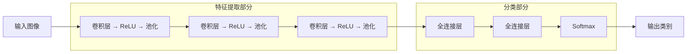

# 神经网络与深度学习：卷积神经网络

本文从全连接网络的局限性出发，介绍卷积操作、池化层等基础组件，并系统梳理 LeNet\-5、AlexNet、VGGNet、GoogLeNet/Inception、ResNet 五大经典架构的设计思想与演进脉络。

# 一、卷积神经网络的动机与基本思想

## 全连接网络的局限性

对于图像任务，全连接神经网络（Fully Connected Network）存在严重的参数爆炸问题：

**参数爆炸：**一张 $224 \times 224 \times 3$ 的彩色图像，输入层有 $224 \times 224 \times 3 = 150{,}528$ 个神经元。若第一隐藏层有 1000 个神经元，则仅第一层就有 $150{,}528 \times 1000 \approx 1.5 \times 10^8$ 个参数，极易过拟合且计算代价极高

CNN 通过两个关键思想解决此问题：**局部连接（Local Connectivity）**和**权值共享（Weight Sharing）**

## 局部连接（Local Connectivity）

（**感受野**，Receptive Field）指的是卷积神经网络每一层输出的特征图（feature map）上每个像素点映射回输入图像上的区域大小。神经元感受野的范围越大表示其能接触到的原始图像范围就越大，也意味着它能学习更为全局，语义层次更高的特征信息；相反，范围越小则表示其所包含的特征越趋向局部和细节。

因此感受野的范围可以用来大致判断每一层的抽象层次。并且我们可以很明显地知道网络越深，神经元的感受野越大。由此可知，深度卷积神经网络中靠前的层感受野较小，提取到的是图像的纹理、边缘等局部的、通用的特征；靠后的层由于感受野较大，提取到的是图像更深层次、更具象的特征。

在视觉感知中，每个神经元只需关注图像的一个局部区域（感受野），而非整幅图像。CNN 中每个神经元仅与输入的一个局部区域相连接，大幅减少连接数。

**全连接网络**

每个神经元连接所有输入像素

参数量：$O(n_{input} \times n_{hidden})$

**局部连接网络**

每个神经元仅连接局部区域

参数量：$O(F^2 \times n_{hidden})$

## 权值共享（Weight Sharing）

同一个特征（如边缘、角点）可能出现在图像的任何位置。CNN 让同一个卷积核（filter）在整个图像上滑动，所有位置共享相同的权重参数。这进一步将参数量从 $O(F^2 \times n_{output})$ 降低到 $O(F^2)$（单个卷积核）。

---

# 二、CNN 整体架构

## 整体架构

_CNN 架构 = 多次 "卷积 →ReLU→ 池化" 逐层提取从简单到复杂的特征，特征图越来越小但通道越来越多，最后展平接全连接层做分类。这种设计同时实现了参数少、利用空间结构、自动学习特征三个目标_

一个典型的 CNN 由多个**卷积\-池化**单元堆叠而成，最终接全连接层进行分类

---

前半部分：特征提取器（Feature Extractor）

Conv → ReLU → Pool（循环多次）

这部分的工作是从原始像素中逐层提取越来越抽象的特征，随着网络深度增加，特征图的空间尺寸逐渐减小（通过池化或大步长卷积），而深度（通道数）逐渐增加（通过增加卷积核数量）

- 浅层：边缘、颜色、纹理

- 中层：局部形状、部件（眼睛、轮子）

- 深层：整体语义（人脸、汽车）

输出是一组压缩后的特征图（比如 7×7×512），浓缩了图像的关键信息。

---

后半部分：分类器（Classifier）

Flatten → FC → Softmax

这部分的工作是拿提取好的特征做决策：

- Flatten：把三维特征图铺平成一维向量（纯形状转换，无计算）

- FC：对所有特征做加权组合，学习 "哪些特征组合代表哪个类别"

- Softmax：把原始分数转为概率，输出最终预测

---

---

## 各层详解

卷积提特征 → ReLU 加非线性 → 池化降尺寸 → 展平变向量 → 全连接做决策 → Softmax 出概率

前面的层负责"看"，后面的层负责"判断"

### 1\. 卷积层（Conv）

卷积层是 CNN 的核心。卷积操作的核心是用一个小的**卷积核（Filter / Kernel）**在输入特征图上滑动，每个位置做元素乘积求和，输出一个值。每个卷积核提取一种特征（边缘、纹理、形状等），多个卷积核产生多通道特征图。

**卷积计算公式：**

$y(i, j) = \sum_{m=0}^{F-1} \sum_{n=0}^{F-1} \sum_{d=0}^{D-1} x(i \cdot S + m,\; j \cdot S + n,\; d) \cdot w(m, n, d) + b$

其中 $F$ 为卷积核大小，$D$ 为输入深度，$S$ 为步长，$b$ 为偏置。

卷积参数与输出尺寸

| 参数            | 说明                                                    |
| --------------- | ------------------------------------------------------- |
| 输入尺寸        | $W \times H \times D$（宽 × 高 × 深度/通道数）          |
| 卷积核尺寸      | $F \times F \times D$（卷积核的深度必须与输入深度一致） |
| 步长（Stride）  | $S$：卷积核每次移动的像素数                             |
| 填充（Padding） | $P$：在输入边界补零的圈数                               |
| 卷积核数量      | $K$：使用多少个不同的卷积核                             |

**输出尺寸公式：**

$W_{out} = \frac{W - F + 2P}{S} + 1$

$H_{out} = \frac{H - F + 2P}{S} + 1$

$D_{out} = K$（输出深度 = 卷积核数量）

输入 $32 \times 32 \times 3$，使用 10 个 $5 \times 5$ 卷积核，stride=1，padding=0：

- 输出宽度：$\frac{32 - 5 + 0}{1} + 1 = 28$

- 输出高度：$\frac{32 - 5 + 0}{1} + 1 = 28$

- 输出深度：$10$

- 输出尺寸：$28 \times 28 \times 10$

- 该层参数量：$10 \times (5 \times 5 \times 3 + 1) = 760$

常用 Padding 策略

| 策略            | Padding 值          | 效果                             |
| --------------- | ------------------- | -------------------------------- |
| Valid（无填充） | $P = 0$             | 输出尺寸缩小                     |
| Same（等尺寸）  | $P = \frac{F-1}{2}$ | 当 $S=1$ 时，输出尺寸 = 输入尺寸 |

---

### 2\. 激活层（ReLU）

卷积的输出是线性运算结果，必须加非线性激活才能让网络学到复杂模式。ReLU 定义为：

$f(x) = \max(0, x)$

正值原样通过，负值直接置零。优点是计算快、缓解梯度消失。ReLU 紧跟在每个卷积层之后，不增加参数。

---

### 3\. 池化层（Pool）

池化对每个特征图的局部区域做降采样，减小空间尺寸。最常用的是 **2×2 最大池化，步长 2**，每个 2×2 区域取最大值，特征图长宽各缩小一半。

池化的作用

- **降低空间维度：**减少后续层的计算量和参数量

- **提供平移不变性：**对特征位置的微小变化具有鲁棒性

- **控制过拟合：**减少特征图的冗余信息

**最大池化（Max Pooling）**

取窗口内的最大值

保留最显著的特征激活

实践中更常用

示例（2×2 窗口）：

$\begin{bmatrix} 1 & 3 \\ 5 & 2 \end{bmatrix} \rightarrow 5$

**平均池化（Average Pooling）**

取窗口内的平均值

保留区域的整体信息

常用于网络最后一层（GAP）

示例（2×2 窗口）：

$\begin{bmatrix} 1 & 3 \\ 5 & 2 \end{bmatrix} \rightarrow 2.75$

典型配置：窗口大小 $2 \times 2$，步长 $S = 2$，将特征图的空间维度缩小为原来的 $\frac{1}{2}$。

池化层**没有可学习参数**，它仅对每个特征图独立操作，不改变深度（通道数）

---

### 4\. 展平（Flatten）

经过多层卷积\+池化后，特征图是三维张量（高 × 宽 × 通道）。展平就是把它拉成一维向量，例如 7×7×512 → 25088 维向量。这一步没有计算，纯粹是形状变换，目的是衔接后面的全连接层。

---

### 5\. 全连接层（FC）

与普通神经网络相同——每个神经元和前一层所有神经元相连。全连接层负责把卷积提取到的空间特征"汇总"为高层语义表示，最终映射到类别数量的维度。

**注意：** 全连接层是参数最多的部分（AlexNet 中 FC 占总参数的 90% 以上），现代网络趋向用全局平均池化替代。

---

### 6\. Softmax

网络最后一层输出 $K$ 个原始分数（logits），Softmax 将其转换为概率分布：

$P(y=k) = \frac{e^{z_k}}{\sum_{j=1}^{K} e^{z_j}}$

输出的 $K$ 个值都在 \(0,1\) 之间且和为 1，最大概率对应的类别就是预测结果。训练时配合交叉熵损失函数使用。

# 三、一些经典 CNN 架构

### LeNet\-5（1990s）

手写数字识别的开山之作，90 年代被美国银行用于支票识别。

- 结构：7 层（卷积 \+ 池化 \+ 全连接交替）

- 意义：奠定了 "卷积 \+ 池化 \+ 全连接" 的 CNN 基本范式

### AlexNet（2012）

ImageNet 2012 冠军，top\-5 错误率 15\.3%（第二名 26\.2%），开启深度学习时代。

- 结构： 5 个卷积层 \+ 3 个全连接层，约 60M 参数

- 创新：
    - ReLU 替代 Sigmoid → 训练快 6 倍，缓解梯度消失

    - Dropout（FC 层 0\.5）→ 减少过拟合

    - 数据增强 → 裁剪、翻转、颜色扰动扩充数据

    - GPU 并行训练 → 首次用两块 GPU 训练大网络

    - LRN（局部响应归一化） → 后来被 Batch Norm 取代

- 意义： 证明了更大的数据 \+ 更深的网络 \+ GPU 算力可以碾压传统方法

---

### VGGNet（2014）

核心思想 ——深度且简洁，一律用 3×3 小核，靠堆深度来提升性能。

- 结构： VGG\-16（13 卷积 \+ 3 FC）或 VGG\-19，约 138M 参数

- 特点：
    - 所有卷积核统一 3×3，步长 1，等宽填充

    - 所有池化统一 2×2，步长 2

    - 每次池化后通道数翻倍：64 → 128 → 256 → 512 → 512

- 两个 3×3 卷积的感受野 = 一个 5×5，但参数从 25*C*2 降为 18*C*2（减少 28%），且多一次 ReLU 非线性，表达能力更强

- 训练技巧： 先训练浅版本（VGG\-11），用其权重初始化更深的版本

- 缺点： 参数量巨大（138M），全连接层占了大部分

---

### GoogLeNet / Inception（2014）

2014 ILSVRC 冠军，22 层但只有 5M 参数（AlexNet 的 1/15），错误率 6\.7%。

- 核心创新 ——Inception 模块： 在同一层并行使用多种卷积核，再拼接：
    - 1×1 卷积：降维 \+ 捕获通道关系

    - 3×3 卷积：中等尺度特征

    - 5×5 卷积：大尺度特征

    - 3×3 最大池化：保留显著特征

- 1×1 卷积降维： 在 3×3 和 5×5 之前先用 1×1 减少通道数，大幅减少计算量（这是参数少的关键原因）

- 全局平均池化： 用 GAP 替代全连接层，把 7×7×1024 的特征图直接平均为 1×1×1024，极大减少参数

- 辅助分类器： 在中间层加额外分类头，缓解深层网络的梯度消失

- 设计哲学： 不是单纯加深，而是加宽（多尺度并行），用巧妙结构换效率

---

### ResNet（2015）

152 层，top\-5 错误率 3\.6%，首次超越人类水平（5\.1%）。

- 核心创新 —— 残差连接（Skip Connection）：

- _H_\(_x_\)=_F_\(_x_\)\+_x_

- 不再让网络直接学目标映射 _H_\(_x_\)，而是学残差 _F_\(_x_\)=_H_\(_x_\)−*x*。如果某层不需要做任何变换，_F_\(_x_\)=0 即可，梯度可以通过 \+_x_ 直接跳过该层回传。

- 解决的问题： 网络加深到一定程度后性能反而下降（退化问题），不是过拟合而是优化困难。残差连接让梯度畅通无阻，使训练上百层成为可能。

- 结构： 大量使用 3×3 卷积 \+ BN \+ ReLU，无全连接层（GAP 直接接分类）

- 参数量： 25M（比 VGG 的 138M 少得多，但性能远超）

- Bottleneck 设计： 深版本用 1×1→3×3→1×1 结构进一步减少计算量

---

# 相关公式

- 卷积输出尺寸：$W_{out} = \lfloor \frac{W_{in} - F + 2P}{S} \rfloor + 1$

- 卷积层参数量：$K \times (F \times F \times D_{in} + 1)$

- 感受野递推：$RF_l = RF_{l-1} + (F_l - 1) \times \prod_{i=1}^{l-1} S_i$

- 残差连接：$y = F(x, \{W_i\}) + x$

- 瓶颈降维：1×1 Conv 将 $C$ 通道降至 $C/4$，3×3 Conv 处理后再 1×1 升回 $C$

---

# 相关概念

| 概念                      | 要点                                                               |
| ------------------------- | ------------------------------------------------------------------ |
| 感受野（Receptive Field） | 每个神经元在原始输入上"看到"的区域大小，随网络深度增大             |
| 特征图（Feature Map）     | 一个卷积核在整张图上滑动后得到的输出，反映该卷积核检测到的特征分布 |
| 步长（Stride）            | 卷积核移动的步幅，stride > 1 可替代池化实现下采样                  |
| 零填充（Zero Padding）    | 在输入边缘补零，保持空间尺寸或避免边缘信息丢失                     |
| 全局平均池化（GAP）       | 对每个特征图取全局均值，输出一个数，替代全连接层减少参数           |
| Batch Normalization       | 对每个 mini\-batch 的特征进行归一化，加速训练、允许更大学习率      |
| Skip Connection           | 将输入跳跃式传递到后面的层，缓解梯度消失，使超深网络可训练         |
| 数据增强                  | 通过随机变换（翻转、裁剪、旋转、颜色抖动）扩充训练集，减少过拟合   |
